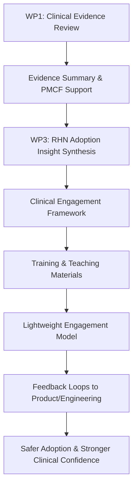

# Anaelle – Placement Work Plan
## Sanome Himan Digital Twin Ltd

This work plan outlines Anaelle’s placement priorities, delivery outputs, and development objectives across clinical evidence review and real-world digital health adoption. The focus is practical: supporting safe deployment and evaluation of AI-enabled clinical decision support in healthcare settings.

---

## 1) Placement Overview

| Area | Focus | Why It Matters |
|---|---|---|
| Clinical evidence | Infection and sepsis evidence review | Supports PMCF, product safety, and clinical communication |
| Adoption and implementation | RHN clinical engagement framework for MEMORI | Improves safe interpretation, confidence, and sustained use |
| Cross-functional exposure | ML, engineering, QARA, commercial, deployment | Builds end-to-end understanding of medtech delivery |

---

## 2) Work Package 1 — Sepsis & Infection Clinical Evidence Review
**Type:** Clinical / research-focused work

### Objective
Support Sanome’s evidence-generation and clinical strategy through structured review of literature on infection detection, sepsis pathways, and digital clinical decision support.

### Activities
| Activity Theme | Scope |
|---|---|
| Targeted literature reviews | Early infection detection; sepsis recognition and escalation pathways; antibiotic decision-making |
| PMCF and evaluation support | Background research to strengthen PMCF and evaluation activities |
| Clinical communication support | Evidence inputs for internal/external clinical documentation |
| Evidence synthesis | Summarise evidence on infection tools, hospital alerts, and digital CDS adoption |

### Outputs
- Structured literature summary document
- Key insights relevant to digital infection detection tools
- Short internal evidence briefing (slides or memo)

### Learning Opportunities
- Clinical evidence generation in medtech
- How literature informs product evaluation, safety, and regulation
- Translating research into practical deployment and product insight

---

## 3) Work Package 3 — Clinical Adoption & Engagement Framework (RHN)

### Objective
Design a structured clinical engagement and teaching framework to support MEMORI adoption at the Royal Hospital for Neuro-disability (RHN), grounded in early PMCF and clinician feedback.

The goal is to convert real-world experience into clear guidance and practical teaching materials so clinicians can interpret and use MEMORI safely—especially in complex patient populations.

### Background (Month 1 Signal)
Early RHN feedback indicates:
- Good initial adoption and workflow fit
- MEMORI is generally easy to locate and use
- Alerts are often interpreted appropriately (review/monitoring more common than escalation), consistent with MEMORI’s role as CDS rather than an automatic escalation trigger

### Emerging Adoption Themes
| Theme | Practical Implication |
|---|---|
| MEMORI may be misread as a NEWS2 replacement | Need explicit differentiation in training |
| Persistently high scores in complex/ventilated patients | Need guidance on baseline-aware interpretation |
| Uncertainty about next steps after alerts | Need simple action framework |
| Positive response to explainability/alert realism | Opportunity to reinforce trust and confidence |
| Clinician interest in giving feedback | Opportunity to formalise feedback loops |

---

## 4) Work Package 3 — Delivery Plan

### 4.1 Synthesise RHN clinician feedback
Review and summarise:
- Month 1 PMCF staff survey findings
- Qualitative clinician feedback and observations
- Real-world alert interpretation patterns

**Themes to analyse**
- How clinicians interpret MEMORI risk levels
- When alerts lead to review, monitoring, or escalation
- Interpretation in complex or ventilated patients
- Understanding of MEMORI alongside NEWS2
- Perceived alert realism and explainability
- Why some alerts do not trigger action when patients are clinically stable

### 4.2 Design an RHN adoption framework
Build a framework for RHN and future deployment sites with:

**Core messages**
- MEMORI supports clinical judgement; it does not replace it
- MEMORI indicates infection risk, not overall deterioration
- Monitoring without escalation is often appropriate

**Safe interpretation principles**
- Interpret scores in clinical context
- Compare signals to patient baseline
- Use MEMORI with NEWS2 and existing escalation pathways

**Common misconceptions to address**
- “MEMORI replaces NEWS2”
- “High scores always require escalation”
- “Low scores mean the patient is safe”

### 4.3 Develop engagement and teaching materials
Create draft resources for induction and ongoing ward education:
- Short training slides (induction + refresher)
- “How to interpret MEMORI scores safely”
- “What to do when you see a MEMORI alert”
- MEMORI vs NEWS2 comparison slide
- Clinician myth-busters
- Brief guidance for matrons and clinical leads

### 4.4 Design a lightweight clinical engagement model
Build a practical, low-burden model for RHN and future sites:
- Short ward-based teaching sessions
- 5–10 minute handover briefings
- Identification of clinical champions
- Structured feedback collection
- Regular feedback loops to product and engineering teams

---

## 5) Work Package 3 — Expected Outputs
Anaelle will deliver:
1. RHN adoption insights summary (from early PMCF)
2. MEMORI clinical engagement framework (reusable across sites)
3. Draft training and engagement materials for clinical teams
4. Proposed engagement + feedback model for RHN and future deployments

---

## 6) Learning and Development Outcomes
This work provides practical exposure to:
- Digital health adoption in real clinical environments
- Safe implementation of AI-enabled clinical decision support
- Converting clinician feedback into deployment/product strategy
- Behavioural adoption and change-support design
- Interaction between technology, workflow, and clinical decision-making

---

## 7) Cross-Functional Exposure Plan

| Team | Exposure Focus |
|---|---|
| ML team | How models are developed, refined, and evaluated |
| Engineering | How product features/workflows are implemented in practice |
| QARA lead | Quality, regulatory, and safety requirements in medtech |
| Commercial | How clinical value is communicated to customers/partners |
| Clinical / Deployment Lead (Edith) | Clinical deployment, stakeholder engagement, safety, implementation planning |

**Additional exposure opportunities**
- Section 251 governance work related to EKHUFT
- Hospital deployments or go-live preparation at EKHUFT and Royal Devon
- Early evaluation and monitoring of MEMORI alerts

---

## 8) Time Allocation (Approx.)

| Work Area | Estimated Effort |
|---|---|
| Clinical workflow and product integration | 50–60% |
| Sepsis / infection research | 30–40% |
| Optional exposure / observation | 10–20% |

---

## 9) Placement Delivery Flow (Visual)

---

## 10) Success Indicators (Suggested)
| Domain | Indicator |
|---|---|
| Evidence quality | Literature summary completed and internally usable |
| Adoption clarity | Staff can articulate MEMORI vs NEWS2 distinctions |
| Behavioural uptake | Training sessions delivered; champions identified |
| Feedback maturity | Structured clinician feedback loop established |
| Deployment readiness | Reusable materials/framework suitable for future sites |

