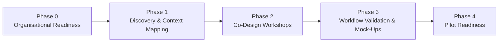

# MEMORI ICU Co-Design Project
## Delivery Phases

> **Current status:** **Phase 0–1 (active)**  
> **Immediate CDL focus:** stakeholder engagement, system understanding, discovery interviews, workflow mapping, and validation of the clinical problem.

---

## Executive Overview

This phased plan outlines how MEMORI will move from **organisational preparation** to **pilot readiness** in ICU settings. The current work is concentrated on building the right clinical and organisational foundation before formal co-design begins.

### Phase Sequence

`Phase 0` → `Phase 1` → `Phase 2` → `Phase 3` → `Phase 4`

| Phase | Title | Primary Outcome |
|---|---|---|
| **0** | Organisational Readiness (CDL Preparation) | Stakeholders aligned and discovery approved |
| **1** | Discovery & Context Mapping | Baseline understanding of ICU workflows and systems |
| **2** | Co-Design Workshops | Clinically agreed workflow and alert concepts |
| **3** | Workflow Validation & Mock-Ups | Usability-tested and refined workflow design |
| **4** | Pilot Readiness | Pilot-ready specification, governance, and evaluation plan |

---

## Visual Process Flow

---

## Phase-by-Phase Plan

### Phase 0 — Organisational Readiness (CDL Preparation)
**Purpose**  
Prepare the organisation so co-design activity is credible, relevant, and supported by key stakeholders.

**What you will be doing**
- Map stakeholders across ICU, infection prevention and control, digital, and research teams.
- Identify clinical champions (e.g., ICU consultant, infection lead).
- Engage ICU leadership early (e.g., clinical director, matrons).
- Explain project scope, purpose, and realistic expectations.
- Align with Trust priorities (AI governance, digital innovation, ICU improvement).
- Clarify local governance requirements (innovation, research, digital approvals).
- Assess local readiness for participation in discovery and co-design.

**Outputs**
- ✅ Confirmed stakeholder map
- ✅ Clinical sponsor/champion identified
- ✅ Agreement to proceed with discovery work

---

### Phase 1 — Discovery and Context Mapping
**Purpose**  
Understand the ICU clinical and technical environment, how infection detection currently works, and where MEMORI risk signals could add practical value.

**What you will be doing**
- Conduct short discovery interviews with ICU clinicians (consultants, registrars, nurses).
- Understand the current ICU system landscape, including:
  - Bedside monitoring systems (e.g., Philips)
  - EPR / core clinical systems
  - Where clinicians currently view key patient information
  - How alerts and monitoring data are surfaced in daily practice
- Request short system walkthroughs / “show me” sessions with digital or ICU teams.
- Map the current infection detection and escalation pathway.
- Identify:
  - Key decision points
  - Delays in recognising infection
  - Information sources clinicians rely on today
- Assess current alert burden, workflow friction, and cognitive load.
- Document current practice before introducing new concepts.

**Outputs**
- ✅ Current-state ICU infection detection workflow map
- ✅ High-level ICU system/information flow map
- ✅ Identified opportunity areas for decision support
- ✅ Summary of clinician insights and pain points

---

### Phase 2 — Co-Design Workshops
**Purpose**  
Work directly with clinicians to design how MEMORI infection risk signals should be presented and used within ICU workflows.

**What you will be doing**
- Facilitate structured multi-disciplinary clinician workshops.
- Explore where MEMORI alerts should appear in workflow.
- Co-design decisions around:
  - Timing of alerts
  - Interpretability of risk scores
  - Escalation expectations and responsibilities
- Test alternative alert and interface concepts.
- Ensure alignment with existing ICU escalation processes.
- Capture and synthesise clinician feedback and preferences.

**Outputs**
- ✅ Co-designed workflow concepts
- ✅ Agreed clinical use cases
- ✅ Initial interface and alert design concepts

---

### Phase 3 — Workflow Validation and Mock-Ups
**Purpose**  
Validate proposed workflows and test usability before technical integration.

**What you will be doing**
- Develop UI mock-ups and representative workflow scenarios.
- Run usability review sessions with clinicians.
- Test whether alerts are:
  - Interpretable
  - Actionable
  - Non-disruptive
- Refine alert logic and display concepts.
- Confirm alignment with governance, safety, and escalation policies.

**Outputs**
- ✅ Validated workflow design
- ✅ Refined UI mock-ups
- ✅ Documented clinical interpretation guidance

---

### Phase 4 — Pilot Readiness
**Purpose**  
Prepare LUHFT and project partners for a potential future feasibility pilot.

**What you will be doing**
- Finalise the clinical workflow specification.
- Support development of:
  - Pilot protocol
  - Governance approach
  - Evaluation metrics
- Align with research teams and NIHR feasibility funding pathways.
- Define data requirements and technical integration considerations.
- Prepare a clinical training and adoption approach.

**Outputs**
- ✅ Pilot-ready workflow design
- ✅ Governance and safety framework
- ✅ Evidence pack supporting NIHR feasibility funding

---

## Current Position and Immediate Next Steps

### Where the project is now
- **Current phase:** **0–1 (active)**

### Immediate CDL priorities
1. Stakeholder engagement
2. System landscape understanding
3. Short discovery interviews
4. Workflow mapping
5. Validation of the clinical problem

### Decision gate to move into Phase 2
Proceed to **formal co-design workshops** only once Phase 0–1 outputs are complete, reviewed, and agreed by key clinical and organisational stakeholders.
