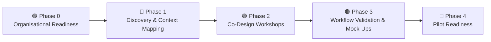

# MEMORI ICU Co-Design Project
## Delivery Phases (Tidy Version)

> **Current status:** **Phase 0–1 (active)**  
> **Immediate CDL focus:** stakeholder engagement, discovery interviews, workflow mapping, and validating the clinical problem.

---

## At-a-Glance Process Flow (Chevron Style)

`Phase 0` ➤ `Phase 1` ➤ `Phase 2` ➤ `Phase 3` ➤ `Phase 4`

- 🟣 **Phase 0:** Organisational Readiness  
- 🔵 **Phase 1:** Discovery & Context Mapping  
- 🟢 **Phase 2:** Co-Design Workshops  
- 🟠 **Phase 3:** Workflow Validation & Mock-Ups  
- 🔴 **Phase 4:** Pilot Readiness

---

## Visual Flow Map



---

## Phase-by-Phase Plan

### 🟣 Phase 0 — Organisational Readiness (CDL Preparation)
**Purpose**  
Prepare the organisation so co-design work is credible, relevant, and supported by key stakeholders.

**What you will be doing**
- Map stakeholders across ICU, infection control, digital, and research teams.
- Identify clinical champions (e.g., ICU consultant, infection lead).
- Engage ICU leadership early (clinical director, matrons).
- Explain project purpose and set expectations.
- Align with Trust priorities (AI governance, digital innovation, ICU improvement).
- Clarify local governance requirements (innovation, research, digital approvals).
- Assess organisational readiness for participation.

**Outputs**
- ✅ Confirmed stakeholder map
- ✅ Clinical sponsor/champion identified
- ✅ Agreement to proceed with discovery work

---

### 🔵 Phase 1 — Discovery and Context Mapping
**Purpose**  
Understand how infection detection currently works in ICU and where AI risk signals could add value.

> **Pre-co-design principle:** focus on situational awareness, not solution design.  
> First understand what already exists so the team avoids proposing duplicate workflows or tools.

**What you will be doing**
- Conduct short discovery interviews with ICU clinicians (consultants, registrars, nurses).
- Map the current infection detection and escalation pathway.
- Identify:
  - Key decision points
  - Delays in recognising infection
  - Information sources clinicians currently rely on
- Understand the existing alert and monitoring environment.
- Identify potential workflow friction or cognitive burden.
- Document current practice *before* introducing new system concepts.

**Outputs**
- ✅ Current-state ICU infection detection workflow map
- ✅ Identified opportunity areas for decision support
- ✅ Summary of clinician insights and pain points

#### Phase 1 Discovery Workplan (Pre-Co-Design)

##### Step 1 — System Landscape Mapping *(critical first step)*
Map the current technical environment before discussing new workflow concepts.

Typical ICU digital ecosystem may include:
- Bedside monitoring (e.g., Philips IntelliVue / ICCA)
- Hospital EPR (e.g., Cerner / Epic / Sunrise)
- Laboratory systems
- Radiology systems
- Observation/early warning systems
- Nurse documentation systems

Clarify:
- Where clinicians actually look for patient data
- Which screens are used during ward rounds
- Which dashboards already exist

Who to ask:
- Digital team
- ICU informatics lead
- Clinical systems team

This can usually be completed in one short call.

**Output:** simple system map, for example:

```text
Bedside monitors (Philips)
        ↓
ICU monitoring system
        ↓
Hospital EPR
        ↓
Clinicians view patient summary
```

##### Step 2 — Quick “Show Me” System Walkthrough
Request a practical walkthrough of how clinicians currently view patient information in ICU.

Suggested ask:
> “Could someone show me how clinicians currently view patient information in ICU?”

Format:
- Informal screen walkthrough
- ~20 minutes
- Ideally with ICU and/or digital representative

Observe:
- Where data appears
- Existing dashboards
- How alerts are presented
- How clinicians navigate across systems

##### Step 3 — Workflow Shadowing *(if possible)*
Even 30 minutes of direct observation is valuable.

Examples:
- Ward round
- Nurse review
- Morning board round

Watch for:
- Which screens remain open
- How frequently systems are checked
- Where decisions are actually made

##### Step 4 — Micro Discovery Interviews (10–15 minutes)
Use brief conversations rather than formal interviews.

Core questions:
1. Where do you usually check patient data first?
2. What systems do you look at most during a shift?
3. How do you usually realise a patient might be developing an infection?
4. Are there already alerts you rely on?

##### Step 5 — Clinical Information Flow Map
Synthesize findings into a practical information flow map.

Example:

```text
Bedside monitor (Philips)
        ↓
Vital signs data
        ↓
Visible in ICU system
        ↓
Also feeds into hospital EPR
        ↓
Clinicians review during ward rounds
```

Then identify:
- Where clinicians actually interact with systems
- Where MEMORI risk information could realistically surface

---

### 🟢 Phase 2 — Co-Design Workshops
**Purpose**  
Work with clinicians to design how MEMORI infection risk signals should be presented and used in ICU workflows.

**What you will be doing**
- Facilitate structured clinician workshops.
- Explore where MEMORI alerts should appear in workflow.
- Discuss:
  - Timing of alerts
  - Interpretability of risk scores
  - Escalation expectations
- Test different alert and interface concepts.
- Ensure alignment with existing ICU escalation processes.
- Capture clinician feedback and design preferences.

**Outputs**
- ✅ Co-designed workflow concepts
- ✅ Agreed clinical use cases
- ✅ Initial interface/alert design concepts

---

### 🟠 Phase 3 — Workflow Validation and Mock-Ups
**Purpose**  
Validate proposed workflows and test usability before technical integration.

**What you will be doing**
- Develop UI mock-ups and workflow scenarios.
- Run usability review sessions with clinicians.
- Test whether alerts are:
  - Interpretable
  - Actionable
  - Non-disruptive
- Refine alert logic and display concepts.
- Confirm alignment with governance, safety, and escalation policies.

**Outputs**
- ✅ Validated workflow design
- ✅ Refined UI mock-ups
- ✅ Documented clinical interpretation guidance

---

### 🔴 Phase 4 — Pilot Readiness
**Purpose**  
Prepare LUHFT and partners for a potential future feasibility pilot.

**What you will be doing**
- Document the final clinical workflow specification.
- Support development of:
  - Pilot protocol
  - Governance approach
  - Evaluation metrics
- Align with research teams and potential NIHR funding pathways.
- Define data requirements and technical integration considerations.
- Prepare clinical training and adoption strategy.

**Outputs**
- ✅ Pilot-ready workflow design
- ✅ Governance and safety framework
- ✅ Evidence/materials supporting NIHR feasibility funding

---

## Current Position and Immediate Next Steps

### 📍 Where the project is now
**Current phase:** **0–1**

### 🎯 Immediate CDL priorities
1. Stakeholder engagement  
2. Discovery interviews  
3. Workflow mapping  
4. Validation of the clinical problem

### 🚦 Gate to move forward
Proceed to **formal co-design workshops (Phase 2)** only after these Phase 0–1 priorities are completed and agreed.
