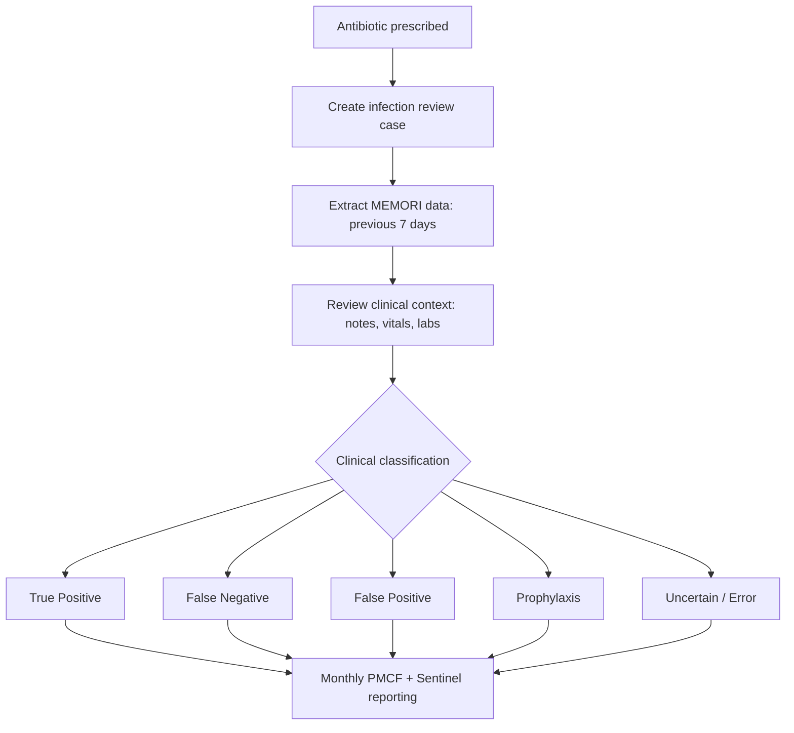
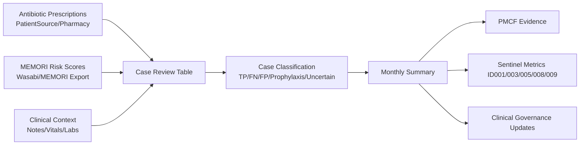

# MEMORI Infection Review Framework (Antibiotic-Triggered)

## Purpose
This framework standardises how to review infection events using antibiotic prescriptions as the trigger and MEMORI risk trajectories as the signal. It supports:

- PMCF evidence generation
- Sentinel framework reporting
- MDR post-market surveillance
- Ward-level clinical governance (e.g., Drapers, Leonora, JEC)

---

## 1) Trigger Event: Antibiotic Prescription
Every infection review begins when an antibiotic is prescribed.

### Required fields
For each patient prescribed an antibiotic, collect:

- Patient ID (pseudonymised)
- Antibiotic name
- Prescription date/time
- Route (IV / oral / topical)
- Indication (if documented, e.g., UTI, chest infection)
- Course duration (if available)

### Data sources
Typically extracted from:

- EPR / prescribing system
- PatientSource medication chart
- Pharmacy or prescribing export

### Why this matters
Each antibiotic start defines one **infection review case**.

**Example:**

| Patient | Antibiotic | Date |
|---|---|---|
| 8883 | Amoxicillin | 12 Aug |

For this case, review the preceding 7 days.

---

## 2) MEMORI Risk Levels (Model Output)
For each antibiotic event, review the MEMORI risk trajectory in the days before prescribing.

### Required fields
- MEMORI risk score
- MEMORI risk category (Low / Moderate / High / Critical)
- Timestamp
- Ideally 6–7 days prior to antibiotic start

### Data sources
- Wasabi / MEMORI analytics dataset
- MEMORI dashboard export

Typical structure:

| patient | timestamp | risk level |
|---|---|---|

### Why this matters
This allows you to determine whether MEMORI:

- Detected infection early
- Missed infection
- Produced false alerts

This dataset drives the risk trajectory chart in the report.

---

## 3) Clinical Context (Notes, Vitals, Labs)
Clinical context determines whether the antibiotic event is true infection, prophylaxis, prescribing error, or uncertain.

### Required clinical evidence around event
- Symptoms (fever, cough, vomiting, etc.)
- Observations:
  - Temperature
  - Heart rate
  - Oxygen saturation
- Laboratory markers (if available):
  - CRP
  - WBC
- Clinician documentation
- Reason for antibiotic
- Confirmation that antibiotics were administered

### Data sources
- PatientSource clinical notes
- Observation charts
- Lab results
- Consultant/clinical review

---

## 4) Antibiotic Classification (Critical Step)
Each antibiotic event must be clinically classified.

| Type | Example |
|---|---|
| Infection treatment | Amoxicillin, Co-amoxiclav |
| Prophylaxis | Trimethoprim nightly |
| Procedure prophylaxis | Mupirocin |
| Prescription error / unclear | e.g., non-specific “smelly urine” without infection evidence |

> Clinical validation is required (e.g., consultant or infection specialist review).

---

## 5) Standard Data Structure (Case-Level Review Sheet)
Use a consistent table structure for all case reviews.

| Patient ID | Ward | Antibiotic | Date | MEMORI trend | Symptoms | Outcome | Classification |
|---|---|---|---|---|---|---|---|
| 8883 | Drapers | Amoxicillin | 12 Aug | Low → High | Fever | Treated | True positive |
| 9603 | Drapers | Mupirocin | 30 Jul | Low | None | Prophylaxis | Prophylaxis |

---

## 6) Source Mapping (By Dataset)

| Data | Source |
|---|---|
| Antibiotic prescriptions | PatientSource / pharmacy export |
| MEMORI risk scores | Wasabi / MEMORI export |
| Observations & symptoms | PatientSource |
| Lab markers | PatientSource |
| Final clinical interpretation | Consultant/clinical review |

---

## 7) Operational Workflow

### Step-by-step process
1. Pull all antibiotic starts for the ward.
2. For each case, extract MEMORI scores for the preceding 7 days.
3. Review notes, observations, and laboratory data.
4. Assign one standard classification label.

### Classification labels

| Label | Definition |
|---|---|
| True positive | MEMORI rose before confirmed infection |
| False negative | Infection occurred but MEMORI remained low |
| False positive | MEMORI rose but no infection occurred |
| Prophylaxis | Antibiotic prescribed for prevention, not infection |
| Prescription error / unclear | Antibiotic prescribed with uncertain indication |
| Uncertain | Clinical picture insufficient or conflicting |

### Workflow diagram

---

## 8) Multi-Ward Application (Drapers, Leonora, JEC)
The process is identical across wards.

You need three datasets per ward:
1. Antibiotic starts
2. MEMORI risk trajectory
3. Clinical review outcome

---

## 9) High-Impact Rule Most Teams Miss
**Exclude prophylactic antibiotics from infection-event performance analysis.**

Examples to exclude from “infection detected/missed” denominators:
- Procedure prophylaxis (e.g., pre-op mupirocin)
- MRSA decolonisation
- Long-term prophylaxis regimens

These should be labelled **Prophylaxis**, not false negatives.

---

## 10) PMCF Outputs and Sentinel Mapping
From this review process, generate:

- Infection detection examples
- True positives
- False positives
- False negatives
- Time-to-intervention evidence

These support Sentinel metrics:
- ID001
- ID003
- ID005
- ID008
- ID009

---

## MEMORI Infection Review Template

### Sheet 1 — Infection Event Review

| Review ID | Patient ID | Ward | Antibiotic | Route | Date Prescribed | Course Length | Infection Suspected | MEMORI Trend (7 days) | Highest MEMORI Level | Symptoms Present | Key Observations | Lab Markers | Infection Confirmed | Intervention Triggered | Outcome | Case Classification | Notes |
|---|---|---|---|---|---|---|---|---|---|---|---|---|---|---|---|---|---|
| 001 | 8883 | Drapers | Amoxicillin | Oral | 12/08/24 | 6 days | Chest infection | Low → Moderate → High | High | Fever, malaise | Temp ↑ | CRP ↑ | Yes | Antibiotics | Treated | True Positive | Observed over weekend |
| 002 | 9468 | Drapers | Penicillin | Oral | 23/06/24 | 5 days | Scarlet fever | Low → High | High | Rash | Temp ↑ | – | Yes | Antibiotics | Treated | True Positive | Rapid escalation |
| 003 | 9603 | Drapers | Mupirocin | Topical | 30/07/24 | 3 days | None | Low | Low | None | Stable | – | No | None | Cleansing before procedure | Prophylaxis | Pre-op MRSA |

### Standardised case labels

| Label | Meaning |
|---|---|
| True Positive | MEMORI increased before infection diagnosis |
| False Negative | Infection occurred but MEMORI stayed low |
| False Positive | MEMORI increased but infection did not occur |
| Prophylaxis | Antibiotic given for prevention |
| Prescription Error / Unclear | Antibiotic given but infection uncertain |
| Uncertain | Clinical picture unclear |

### MEMORI trend field guidance
Record the pre-antibiotic trajectory explicitly.

Examples:
- Low → Moderate → High
- Low → Low → Low
- Moderate → High
- Low → Moderate

Purpose: demonstrates whether MEMORI signalled risk before intervention.

---

## Monthly Summary for PMCF Reporting

| Month | Ward | Total Antibiotic Events | True Positives | False Positives | False Negatives | Prophylaxis | Uncertain | Notes |
|---|---|---:|---:|---:|---:|---:|---:|---|
| Feb | Drapers |  |  |  |  |  |  | Good early detection |
| Feb | Leonora |  |  |  |  |  |  | One missed infection |
| Feb | JEC |  |  |  |  |  |  | Stable profile |

### Sheet 3 — Model Performance Snapshot

| Metric | Value |
|---|---|
| Total infection events |  |
| True positives |  |
| False negatives |  |
| False positives |  |
| Sensitivity |  |
| Precision |  |

Supports Sentinel indicators:
- ID001 (early intervention)
- ID003 (intervention triggered)
- ID005 (unnecessary treatment)
- ID008 (over-alerting)
- ID009 (under-alerting)

---

## Minimum Required Data Pack (Monthly)

### 1) Antibiotic prescribing data
**Source:** PatientSource medication chart / pharmacy export  
**Fields:** patient ID, antibiotic name, prescription date/time, route

### 2) MEMORI risk data
**Source:** Wasabi / MEMORI analytics  
**Fields:** patient ID, timestamp, risk level, risk score  
**Window:** 7 days pre-antibiotic

### 3) Clinical context
**Source:** notes, observation charts, lab panels  
**Look for:** fever, raised CRP, elevated WBC, symptom pattern, consultant documentation

---

## Bias-Control Rule (Mandatory)
Exclude events where antibiotics were used for:

- Prophylaxis
- MRSA decolonisation
- Procedure preparation
- Long-term prevention regimens

These are **not** infection misses and must not be counted as false negatives.

---

## Monthly Narrative Output (Example)
"Seven antibiotic events were reviewed across Drapers, Leonora, and JEC. MEMORI risk increased prior to antibiotic prescription in four cases (true positives). Two prescriptions were prophylactic and excluded from infection performance analysis. One case remained clinically uncertain."

Use this narrative in:
- PMCF reports
- Sentinel monitoring updates
- Clinical governance reporting

---

## Data Flow Diagram

