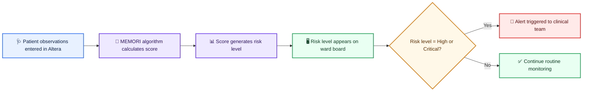

# MEMORI Patient Observation to Alert Workflow

## Step-by-step flow

1. **Patient observations are entered in Altera.**
2. **MEMORI computes a score** from the submitted observations.
3. **The score maps to a risk level** (e.g., Low, Medium, High, Critical).
4. **The risk level is displayed on the ward board** for clinical visibility.
5. **If risk is High or Critical, an alert is triggered** for clinical response.
