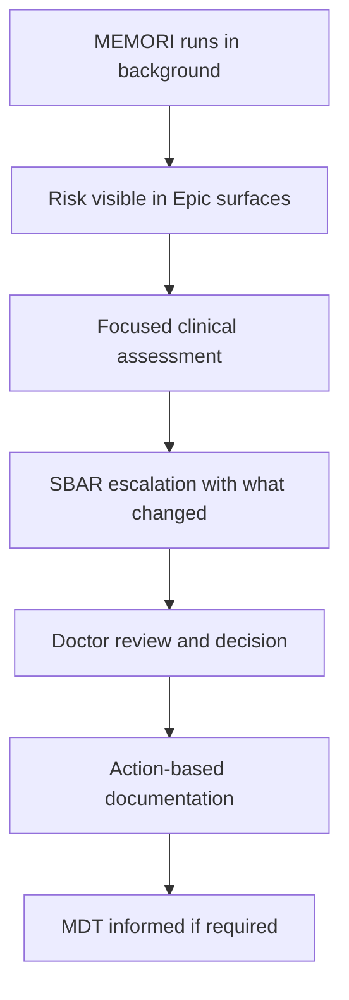
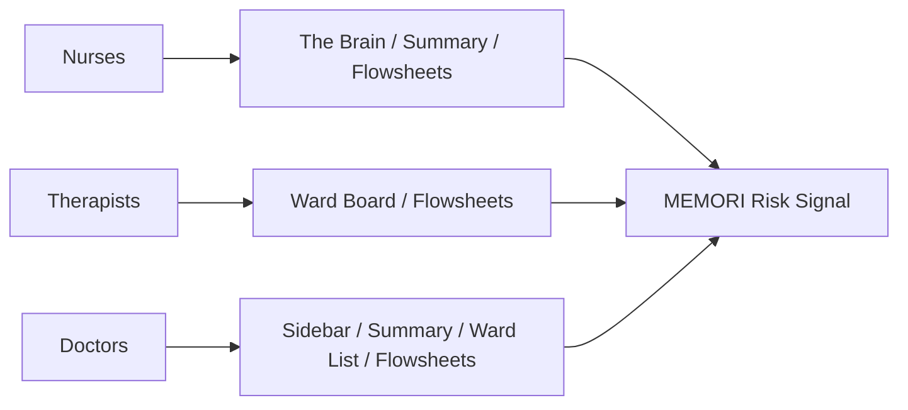
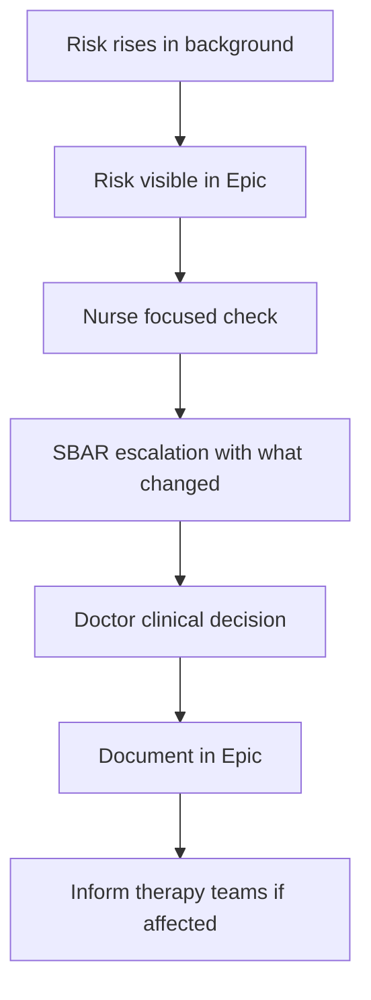

# Document Overview

## Title
MEMORI Clinical Deployment Protocol (Draft)

## Date
11 February 2026

## Document Control
| Field | Value |
|---|---|
| Document ID | Co-Design 01 Clinical Deployment Protocol |
| Version | 1.0 |
| Status | Draft for internal review and RDUH stakeholder sign-off |
| Applies to | RDUH only (Yealm & Clyst initial deployment; future wards via formal change control) |
| Device | MEMORI (EU MDR Class IIb SaMD) |
| Owner | Clinical Deployment Lead |
| Approver | RDUH & Sanome |

## Related Documents
- Co-Design and workflow mapping transcripts 05 February 2026
- List of Attendees

---

## Executive Summary
This protocol defines the safe, usable, and operationally realistic deployment of MEMORI – our CE product for early detection of hospital-acquired infection (HAI) risk within Royal Devon University Healthcare NHS Foundation Trust (RDUH).

It formally specifies the clinical setting, population, site-specific objectives, governance model, safety controls, evaluation approach, and operational requirements for Phase 1 deployment. Phase 1 refers to the initial controlled deployment of MEMORI within Yealm and Clyst stroke services only.

The deployment aims to:
- Improve early recognition of hospital-acquired infection risk
- Reduce cognitive load and manual data hunting in Epic
- Support structured escalation and clearer SBAR communication
- Avoid increasing alert fatigue
- Integrate safely into existing Epic workflows

MEMORI is a regulated AI-enabled clinical decision support system deployed within live stroke services in the NHS. Although it is non-interruptive and advisory in nature, it influences clinical awareness and escalation decisions. For this reason, deployment must be defined following co-design and must meet NHS clinical safety standards (DCB0129/0160), medical device post-market surveillance requirements, and RDUH digital governance processes.

This protocol therefore does more than describe placement in Epic. It defines:
- The clinical setting and intended population
- The specific site-level objective
- Clear boundaries of intended use
- Human factors controls and alert fatigue safeguards
- Governance and oversight responsibilities
- Go-live controls and hypercare monitoring
- Post-market clinical follow-up and evaluation approach
- Formal change control processes

This level of structure ensures that MEMORI is deployed safely, transparently, and responsibly, without increasing clinical burden or introducing unmanaged risk.

---

## Clinical Setting and Population
MEMORI will be deployed within RDUH stroke and neuro-rehabilitation pathways:
- Clyst Ward – Hyperacute/acute stroke and healthcare for older people patients
- Yealm Ward – Stroke rehabilitation with mixed medical patients

The population includes adult inpatients managed under stroke and neuro-rehabilitation care, including:
- Patients with prolonged length of stay
- Frailty and multimorbidity
- High aspiration, UTI, and chest infection risk
- Patients in whom deterioration may be subtle, atypical, or qualitative

## Intended Clinical Objective
The site-specific objective is to improve earlier recognition and review of hospital-acquired infection risk in stroke and neuro-rehabilitation inpatients by surfacing a non-intrusive infection-risk signal with structured “what changed” context within Epic, enabling timely clinical assessment and escalation without increasing alert fatigue or documentation burden.

MEMORI supports clinical judgement. It does not replace NEWS2, diagnose infection, or mandate antimicrobial treatment.

## Deployment Scope
Phase 1 is limited to:
- Yealm and Clyst wards only
- Early hospital-acquired infection risk recognition
- Non-interruptive Epic integration (patient list, sidebar, and flowsheet indicator)
- Advisory guidance only (no automated prescribing)

Expansion beyond this scope requires formal change control.

## High-Level Success Criteria
Deployment success at RDUH will be defined by evidence that MEMORI:
- Is visible, used, and understood by intended roles (nursing, doctors, therapies)
- Improves situational awareness and reduces manual information hunting
- Improves escalation quality (SBAR includes clear “what changed” context)
- Does not increase alert fatigue, unsafe reliance, or inappropriate antibiotic prescribing
- Operates safely with correct ward/bed attribution, auditable access, and effective downtime handling

Governance and Oversight of this deployment is governed through joint RDUH–Sanome clinical safety, digital, and information governance processes.

## Governance and oversight
Phase 1 deployment is jointly overseen by:
- RDUH Clinical Sponsor (Stroke Services)
- RDUH Digital / Epic Team
- RDUH Clinical Safety Officer (DCB0160 responsibilities)
- RDUH Information Governance
- Sanome Engineering Lead
- Sanome Clinical Deployment Lead
- Sanome Clinical Safety Officer (DCB0129 responsibilities)

Oversight includes:
- Approval of Epic placement and role visibility
- Approval of risk-level interpretation and NBAs
- Review of hazard log and safety controls
- Go-live readiness sign-off
- Hypercare safety monitoring
- Approval of any post-go-live changes via change control

No live deployment will occur without formal RDUH clinical, digital, and safety approval.

## Evaluation Approach (Post-Market Clinical Follow-Up Intent)
Evaluation will follow a structured post-market clinical follow-up (PMCF) approach, co-designed and finalised with RDUH prior to go-live.

Measures will include:
- Process measures (usage, time-to-review where feasible, SBAR quality, training completion)
- Outcome proxies (infection-related escalation and transfer patterns, cautious attribution)
- Balancing measures (antibiotic prescribing patterns, staff workload perception, trust and comprehension)

Evaluation focuses on workflow fit, safe use, and early recognition rather than diagnostic performance claims.

## Why Co-Design, Training, and Monitoring Are Included in This Protocol
Co-design and workflow mapping form the evidence base for safe integration into real Epic workflows.

Their outputs directly inform:
- Human factors controls (alert fatigue mitigation)
- Role-based training and readiness thresholds
- Go-live controls and downtime planning
- PMCF measures and safety monitoring

For this reason, training, monitoring, and governance are included within this deployment protocol rather than treated as separate documents.

## Why MEMORI is needed at RDUH
- High cognitive load due to fragmented information across multiple Epic views and note types ("too many clicks").
- No single "what changed" view between shifts/days.
- High NEWS scores highlighted in sidebar, and patients whose observations point to possible sepsis receive pop-ups on opening patient record.
- MDT updates (pharmacy, therapies, nursing) are often hidden in full chart views, increasing reliance on verbal handover.
- Alert fatigue is already significant; additional interruptive alerts risk being ignored.
- Stroke and neuro-rehab deterioration can be subtle or atypical (functional, behavioural, neurological, swallow/aspiration, therapy tolerance).

## Intended use and boundaries
MEMORI will:
- Run in the background and display a risk signal (Low, Moderate, High, Critical) in Epic where clinicians already work.
- Provide brief explainability (why risk increased) and "what changed" with trend context to support clinical reasoning.
- Support earlier review and escalation where clinically indicated without forcing antimicrobial escalation.

MEMORI will not:
- Replace clinical judgement, NEWS2, or local escalation policies.
- Diagnose sepsis, stroke recurrence, PE, or other non-infective deterioration in this initial scope.
- Introduce uncontrolled pop-ups or workflow-breaking interruptions without explicit RDUH agreement and clinical safety sign-off.

## Key outputs
- This protocol (finalised post sign-off).
- Co-design evidence pack and workflow maps ("before" and "with MEMORI").
- Epic placement decision log and local escalation ladder per risk level.
- Training pack, go-live outline and hypercare plan, downtime plan. The Hypercare is the enhanced support period immediately after go-live to ensure the system is working safely and staff feel supported while using it in practice.
- Safety artefacts (hazard log, controls, monitoring checks) and PMCF evaluation plan.
- Risk log and change control approach.

## Phase 1 Definition (Initial Controlled Deployment)
Phase 1 is limited to:
- Adult inpatients under stroke and neuro-rehabilitation care.
- Early recognition of hospital-acquired infection risk only.
- Non-interruptive Epic integration (patient list, sidebar, flowsheet indicator).
- Advisory explainability and guidance (no automated decision-making).
- Structured training, hypercare monitoring, and safety review.

Expansion beyond this scope (additional wards, additional deterioration types, interruptive alerting, new data feeds, or automated decision support) requires formal change control and governance approval.

---

## 1. Background and context (RDUH only)

### 1.1 Clinical setting
**Clyst Ward (Hyperacute/Acute Stroke and healthcare for older people)**
- Higher acuity and time-critical workflow with frequent reviews and investigations.
- Typical length of stay: 3–10 days.
- Key risks: aspiration; pneumonia/chest infection; catheter/UTI; delirium/confusion; dehydration; immobility complications.

**Yealm Ward (Stroke rehabilitation + mixed medical)**
- Longer length of stay: weeks (often 4–6+).
- Higher risk of subtle deterioration over time and rehab tolerance changes.
- Key risks: aspiration/swallow issues; catheter/UTI; prolonged immobility; frailty/comorbidity.
- Patients may transfer back to acute if medically unstable (not always infection-related).

### 1.2 Observations and patient risks (stroke and neuro-rehab reality)
Teams emphasised that observation trends are most useful early in admission, before staff know a patient’s baseline. Over time, staff rely more on familiarity and qualitative change.

High-signal concern triggers beyond routine observations:
- Blood pressure changes (common early indicator; baseline may be atypical in this population).
- Slurred speech or new/worsening neurological change.
- Confusion/delirium or behaviour change (agitation, reduced engagement).
- Leaning/postural change.
- New or increasing oxygen requirement.
- Swallow/aspiration concern and secretions (SALT input).
- Reduced therapy tolerance and functional decline.

### 1.3 Operational pressures (cross-cutting)
- Delays in discharge packages extend length of stay and increase infection exposure.
- Staffing patterns differ across day/night/weekend; escalation routes differ out of hours.
- Staff use multiple devices and Epic contexts; views differ by role and chart checking may be intermittent.

### 1.4 Digital context (Epic + connected systems)
- Observations captured via observation devices and stored in Epic flowsheets.
- Laboratory results available in Epic.
- Imaging in PACS (Insignia) accessed via Insight tools through Epic.
- Devices: desktops/WOWs primary; some laptops; iPads used for food orders/consent; nurses may use Rover; doctors may use Haiku.
- Browser: Edge is official; Chrome may be used locally (confirm build restrictions).

## 2. Purpose, scope and intended use

### 2.1 Purpose
To define a safe, usable and operationally realistic method for deploying MEMORI into RDUH stroke services, ensuring the tool supports existing workflows, reduces cognitive load, and strengthens early recognition of hospital-acquired infection risk without adding digital burden.

### 2.2 Scope
- Wards: Yealm and Clyst stroke services.
- Intended use: support early recognition of hospital-acquired infection risk (not diagnosis).
- Deployment includes Epic workflow integration, training, controlled go-live and monitoring (subject to approvals).

### 2.3 Intended use statement (Summary)
MEMORI is an AI-enabled clinical decision support tool that provides an infection-risk signal and supporting context to help clinicians recognise potential hospital-acquired infection risk earlier, particularly where deterioration may be subtle. MEMORI is used alongside routine clinical assessment, NEWS2, observations, laboratory results, imaging, and local escalation pathways.

## 3. Co-design method and workflow mapping methodology

### 3.1 Session aims
- Capture current-state (before MEMORI) workflow screen-by-screen for nurses, doctors and therapies.
- Identify pain points, workarounds, and risk points.
- Co-design target-state (with MEMORI): placement, escalation and documentation expectations.
- Define information needed at each MEMORI risk level to act safely and efficiently.

### 3.2 Workflow mapping capture fields
For each workflow step, we capture:
- Step name and Epic location (tab/view).
- Inputs checked and decision point.
- Outputs (note, order, escalation message).
- Pain points and workarounds.
- Safety risk and opportunity for MEMORI (summarise, surface, prompt, trend, link).

### 3.3 Table 1. Co-design outputs and protocol implications
| Co-design output | Protocol implication |
|---|---|
| “Too many clicks” | Minimal surfaces + deep links; short role-based training. |
| Do not want more alerts | Avoid pop-ups; use patient list, sidebar and flowsheet indicator. |
| Subtle deterioration first | PMCF focuses on process and proxy measures (not diagnosis). |
| Need "what changed" | Explainability must show deltas and drivers. |
| Ward mix is complex | Downtime rules and safety controls must be explicit. |
| Rotating staff | Training audiences and adoption tracking are mandatory. |
| Consultant Dan: wants 72h vitals + infection markers + eGFR + actions | At-a-glance content should include these; NBA text must be policy-aligned and practical. |

## 4. Current State Workflow, touchpoints per transcripts

### 4.1 Ward-specific workflow before MEMORI
#### 4.1.1 Clyst (Hyperacute/Acute stroke) – at-a-glance requirements
- 72-hour vitals trend (full set).
- Infection markers: recent bloods and microbiology.
- Renal function (eGFR).
- Antibiotics status (where visible).
- Diagnostic framing (e.g., consider chest infection) and clear next actions aligned to local policy.

#### 4.1.2 Yealm (Stroke rehab + mixed medical)
- Complete neuro observation set (FAST, GCS, neuro observations) plus general vitals.
- Needs 'what changed' (trend deltas) and action guidance; deterioration is not always infection-related.
- If anything out of range, patient may require transfer back to acute.
- Preferred placement: MEMORI indicator within Epic flowsheets.

## Clinicians workflow mapping - before MEMORI

### Current State Workflow (Before MEMORI)
#### 3.1 Admission & Clerking
- Stroke clerking template not always fit for purpose and not consistently used.
- The stroke clerking template typically defaults for doctors working on the stroke service; however, doctors from other specialties may default to the acute medicine clerking document, which is often more comprehensive.
- Clinical information is scattered across multiple tabs in the record.
- GP records are manually checked.
- Smartphrases are used inconsistently across clinicians.

Risk: Fragmented initial clinical picture.

#### 3.2 First 72 Hours
Triggers for clinical review include:
- NEWS2
- CRP
- VBG / lactate
- SALT swallow concerns

Key problems:
- No consolidated view of patient trends.
- Subtle deterioration may be missed.

Pain points observed:
- MDT notes are not embedded directly within the main clinical record, but are primarily visible through the Notes Summary tab when viewed in list format, which can make them less visible during routine review.
- Microbiology results may be buried within different sections of the record.
- Laboratory trends often require manual review across multiple entries.
- Documentation burden can be time-consuming for clinicians.

#### 3.3 Ward Rounds
Consultant ward round templates typically include:
- VTE and anticoagulation review
- Observations including stroke-specific parameters
- Glucose monitoring
- Blood tests
- Capacity assessment
- Family updates

#### 3.4 Infection Recognition & Escalation (Before MEMORI)
Typical escalation pathway:
Nurse → Doctor → Consultant

Weaknesses observed in practice:
- Escalation summaries can be incomplete or lack clinical context.
- Decision-making can be NEWS2-heavy but context-light.
- Escalation practices may be less consistent during night shifts.

## Discharge workflow mapping

### Discharge Workflow – RDUH Stroke Wards (Current State Only)
1. **Medical Review & Decision**
   - Consultant or Registrar determines the patient is medically fit for discharge.
   - Decision is documented in EPIC progress notes.
   - Discharge plan confirmed (e.g. home, rehabilitation, transfer).

2. **Medication Review & TTO**
   - Junior doctor completes the discharge prescription (TTO) in EPIC.
   - Medications are reviewed and optimised.
   - Pharmacy review and dispensing take place.
   - System alerts (e.g. prophylaxis alerts) must be actioned before proceeding.

3. **Discharge Summary**
   - Junior doctor prepares the discharge letter in EPIC.
   - This includes:
     - Final diagnosis
     - Stroke details
     - Hospital course
     - Investigations
   - The discharge summary may be compiled progressively during admission or completed closer to the discharge date.

4. **Outstanding Task Check**
   Ensure the following are completed:
   - VTE assessment completed
   - Test status reviewed
   - Recent bloods and imaging reviewed
   - Follow-up referrals requested
   - Relative / next of kin updated

   Where relevant:
   - Mental capacity documented.

   These tasks may be completed progressively or finalised near the discharge date.

5. **Therapy Sign-Off (if required)**
   OT / PT / SALT confirm:
   - Mobility status
   - Swallow status
   - Equipment needs
   - Community referrals
   - Rehabilitation recommendations

6. **Nursing Discharge Preparation**
   Nursing team completes final preparation:
   - Final observations recorded
   - Removal of cannulas or catheters if appropriate
   - Medication counselling provided
   - Patient property checked
   - Transport arranged if required

7. **Patient Leaves Ward**
   - Patient is discharged from the ward once all steps are completed.

### 4.2 Pain points, opportunities and digital disconnects
- Fragmented information and excessive navigation (often 4–8 screens to build a picture).
- No consolidated "what changed" view between shifts/days.
- Manual chasing of results, imaging and tasks.
- Documentation duplication across roles; copy-forward risk in medical notes.
- Alert fatigue and desensitisation to existing EPR alerts.
- Limited at-a-glance visibility of deterioration signals unless the chart is opened.
- Atypical deterioration in stroke patients (functional/neuro/swallow/behavioural changes).
- Misalignment with mixed-pathway ward reality (Yealm) leading to workarounds.

### 4.3 Target state workflow (with MEMORI)
This section explicitly defines the intended future state so that the difference between “Before MEMORI” and “With MEMORI” is operationally clear.

#### 4.3.1 What changes with MEMORI
- MEMORI runs in the background and provides a risk level signal (Low/Moderate/High/Critical).
- Risk signal is visible in Epic surfaces clinicians, nurses and AHPs already use (patient list, patient sidebar, and flowsheets for nursing).
- “What changed” and brief explainability reduce manual hunting across 4–8 screens.
- Assessment and escalation occur only when clinically indicated; there is no automatic antimicrobial escalation.
- Documentation is action-based only, to avoid increasing burden and duplication.
- MEMORI remains additive: standard care continues if MEMORI is unavailable (downtime principles apply).

## 5. Target state workflow and technical integration

### Figure 3 Workflow integration
Figure 3 shows the target clinical workflow. MEMORI provides passive situational awareness, supports focused assessment, and escalates only when clinically indicated. The technical pathway required to surface MEMORI safely in Epic without disrupting workflow will be decided by the Engineers.

### 5.1 EPIC integrations - MEMORI risk column placement
During co-design walkthroughs, two high-value and workflow-appropriate integration points consistently emerged. The embedded screenshots below illustrate these views as used in practice at Royal Devon. They are included to:
- Evidence real-world EPIC usage.
- Anchor MEMORI placement decisions in existing workflows.
- Minimise alert fatigue by embedding signals where clinicians already look.
- Embed MEMORI within these two locations so infection-risk signals are surfaced passively in places clinicians already look, rather than through intrusive alerts or additional dashboards.

These locations reflect where clinicians and nursing staff already spend time when triaging patients, preparing for ward rounds, and reviewing individual cases, and therefore minimise the risk of alert fatigue or workflow disruption.

### MEMORI placement – RDUH co-design output
Co-design sessions at Royal Devon (Clyst acute stroke and Yealm stroke neuro rehab wards) consistently highlighted where different professional groups actually work in Epic. This informs where MEMORI should be placed so it is visible in the natural workflow of nurses, therapists and doctors.

1. **Cross-role “high value” placement locations (all roles)**
   Across interviews with stroke rehab doctors, junior doctors, nurses, ward managers and therapists, the following locations were repeatedly identified as high value integration points for MEMORI:
   - Epic sidebar – described by the stroke rehab doctor as “open all the time” and role specific; seen as the most visible place for MEMORI because it is present on every screen.
   - Flowsheets – central hub for vitals and nursing/therapy documentation, used heavily by doctors, nurses and therapists on both Clyst and Yealm.
   - Patient summary page – key handover view for doctors and nurses, already showing NEWS trends, bloods and imaging.
   - Ward list – customisable overview used by doctors and therapists (printed lists, bed based planning).
   - Patient information boards / corridor boards – large ward level display in Clyst, showing NEWS, falls risk, EDD etc., with an explicit request that MEMORI appear here too.

2. **Nurses – “The Brain” as primary navigation view**
   Clyst Ward (acute stroke) nurses and the Ward Manager specifically described The Brain in Epic as their most used screen:
   - They listed their main screens as: Summary, Flowsheets, The Brain, Drug chart.
   - They stated that “The Brain – will use the most”, because its icons direct them to key areas (e.g. flowsheets) and it acts as their central navigation and workload view.

3. **Therapists – flowsheets and ward/board views as infection awareness points**
   Therapists (OT/physio) and the Head Therapist Angie described a workflow where they:
   - Start their day by printing a handover board view derived from the Epic ward board, which already includes NEWS and key clinical information.
   - Check observations and vitals in flowsheets before seeing patients.
   - Want to be aware of infection risk “before you visit a patient… like NEWS”, explicitly linking MEMORI to the same mental slot as NEWS.

4. **Synthesis – co-designed placement principles for stroke/neuro**
   Across nurses, therapists and doctors, the co-design mapping gives a coherent placement strategy:
   - For nurses: MEMORI must appear in The Brain, Summary and Flowsheets.
   - For therapists: MEMORI must be visible in the ward/board view and flowsheets.
   - For doctors: MEMORI should be available in the Epic sidebar, Summary, Flowsheets and Ward list.

### Figure 4. Epic Patient List View – Doctor Ward Management Screen
Figure 4 shows where clinicians manage and prioritise their own ward patients. This view is routinely used at the start of shifts and immediately prior to ward rounds. In this view, MEMORI infection-risk status would be displayed as a dedicated column within the patient list, with quick access to further detail if required. Note that patient lists are customisable; doctors would need to add MEMORI column to their list template via list properties.

### 5.2. MEMORI tile placement
This is the patient-level chart view, specifically the left-hand sidebar (Figure 5), which is visible across multiple EPIC contexts and user roles during individual patient review. Doctors use this screen at the beginning of the day and before ward rounds, making it an ideal location for early situational awareness. A column-based signal enables rapid identification of higher-risk patients without interrupting workflow or forcing action. It supports prioritisation decisions, such as which patients to review first, rather than creating additional tasks or alerts.

The clinical benefit of this placement is improved awareness of rising infection risk alongside existing prioritisation logic, such as NEWS trends, patient location, and consultant allocation.

### Figure 5. Epic Patient Summary View – Left-Hand Sidebar
This Figure 5 shows a left-hand sidebar which is visible across multiple EPIC contexts and roles and is routinely checked during ward rounds, ad-hoc reviews, and escalation discussions.

In this location, MEMORI would appear as a risk indicator or tile within the sidebar, showing the current infection-risk level and allowing clinicians to click through to supporting context and explainability where needed.

The sidebar is consistently visible and does not require navigation to a separate screen, allowing clinicians to notice changes in risk while reviewing notes, results, or plans. This supports a “notice, then explore if needed” interaction model, rather than forced pop-ups or alerts.

The clinical benefit is timely infection-risk visibility at the point of decision-making, supporting earlier review and escalation where appropriate, while avoiding alert fatigue and unnecessary interruption. These proposed integration points were identified through clinician-led walkthroughs and will be confirmed through formal co-design sessions, usability and human factors testing, and clinical safety review prior to go-live.

### Figure 6. Nursing flowsheet view — MEMORI indicator placement (placeholder)
[INSERT NURSING FLOWSHEET SCREENSHOT HERE]
(Annotate with arrows to show MEMORI indicator near observations/trends)

### 5.3 Wish List for MEMORI Functionality and Integration
This section summarises what RDUH clinicians have stated they would like MEMORI to provide in practice. These requirements emerged directly from co-design workshops, workflow walkthroughs, and multidisciplinary discussion across Yealm and Clyst wards. The focus is not on adding new functionality, but on improving visibility, clarity, and efficiency within existing Epic workflows.

The following (Figure 3) design principles were consistently emphasised during co-design. The overall intent is to enhance awareness and clarity while preserving clinical judgement, minimising alert fatigue, and maintaining alignment with local escalation policies.

### What Clinicians Want MEMORI to Deliver
**Key Deliverables**
- Real-world routines and rather than graph-heavy views.
- Graphs are acceptable and useful for different clinicians, but trends are easier to spot if graphs are aligned.
- Provide a unified daily snapshot showing key changes, risks, and clinical priorities at a glance.
- Support earlier infection risk detection where presentations are subtle, atypical, functional, behavioural, or neurological rather than purely physiological.
- Clearly visualise trends in observations, NEWS2 trajectories, and selected key blood results without requiring navigation across multiple Epic screens.
- Surface a concise “what changed” explanation with stroke-specific details to support rapid interpretation and escalation decisions.
- Integrate in a workflow-aware and non-intrusive manner aligned to real ward routines.
- Reduce manual information hunting and duplication by intelligently surfacing existing data where feasible.

**Design Expectations**
The following design principles were consistently emphasised during co-design:
- No additional interruptive pop-ups unless explicitly agreed and safety-approved.
- Visibility within screens clinicians already use (patient list, sidebar, flowsheets).
- Short, structured text explanations rather than graph-heavy dashboards.
- Risk signals that assist prioritisation but do not mandate action — advisory support only, not diagnostic.

**Operational Aim**
- Makes deterioration easier to notice.
- Makes change easier to interpret.
- Strengthens SBAR escalation quality by surfacing structured context.
- Reduces cognitive load without increasing digital burden.

### 5.4 Visibility model
- Ward nurses and nurse-in-charge (triage, monitoring, timely escalation).
- Junior doctors (prioritisation, task focus, rapid 'what changed').
- Consultants (pattern recognition and ward-level scanning during rounds).
- Therapists: due to early detection of functional/behavioural change.

## Early signs of infection — by role (stroke and neuro-rehab context)
Derived from transcripts (see Appendices).

### A. Early signs therapists see
Therapists often detect deterioration before vitals change because they observe function.
- Functional therapy tolerance (fatigues much earlier than baseline)
- Drop in engagement or motivation
- Unable to complete previously achieved tasks
- Reduced mobility compared to previous session
- New postural instability
- Increased assistance required for transfers
- Slower processing speed during tasks

RISK: fragmented initial picture.

Nuances therapists highlighted:
- Stroke fatigue can mimic infection.
- Aspiration risk is high-value in rehab.
- Deterioration may be qualitative, not physiological.

### B. Early signs nurses see (often first to detect)
**Physiological**
- Rising NEWS2
- Oxygen requirement increase
- New tachycardia
- New low-grade temperature (even 37.8 in elderly)
- Drop in BP (context dependent)

**Clinical differentials**
- Chest infection vs PE
- UTI vs delirium vs constipation
- Stroke recurrence vs infection
- Aspiration pneumonia vs fatigue
- Anticoagulation-related complications

RISK: fragmented night picture.

Practical reality:
- NEWS may not reflect deterioration
- Obs machines auto-feed → delay
- Recent bloods & microbiology
- Infection markers

### C. Early signs doctors see
- Doctors detect patterns and risk clusters.
- Nurses are the earliest detection layer.
- Rising NEWS2
- Oxygen requirement increase
- New tachycardia
- Radiology patterns (CXR, ILM, CT)
- Vitals over 3 days (Dr Dan requested 72-hour full vitals view)

**Clinical differentials**
- Chest infection vs PE
- UTI vs delirium vs constipation
- Stroke recurrence vs infection
- Aspiration pneumonia vs infection
- Anticoagulation-related complications

**Doctor’s specific needs**
- 3-day full vitals
- Diagnosis context
- Poor oral intake
- Increased confusion without clear cause

Therapies – early cues and escalation: Early cues: reduced tolerance, fatigue, engagement drop, postural instability, confusion, secretions affecting swallow. Escalation to nursing/medical as soon as concerns arise. Visibility should support shared situational awareness without adding tasks.

Obs machine auto-feed -> delay - unclear what was meant by this. Did you mean that the nurses might do observations across a whole bay but then only notice the NEWS score after they get back to their computer?

### 5.5. Escalation ladder (RDUH workflow – to validate)
1. MEMORI risk rises in the background.
2. Risk becomes visible in Epic (patient list, sidebar and/or flowsheets).
3. Nurse performs a focused check (observations review, bedside assessment, baseline comparison).
4. SBAR escalation including 'what changed' and likely driver (vitals, neurology, oxygen, labs, swallow/aspiration).
5. Doctor review and clinical decision (investigate, treat, monitor, transfer).
6. Decision documented in the appropriate Epic note type (action-based, not duplicative).
7. Therapy teams informed if rehabilitation plans/scheduling are affected.

## 6. MEMORI risk levels, Next Best Actions and principle

### 6.1 Explainability dashboard functionality – Clinicians wish list
- Short text explanation of why risk increased.
- 'What changed' relative to baseline (direction and key drivers).
- Relevant trends: MEMORI trajectory, vital signs and selected key blood results.
- Optional stroke-specific context where safe and feasible (e.g., swallow risk cues).
- Provide a link-out from the MEMORI explainability view to approved local antimicrobial guidance (subject to RDUH digital policy). Guidance must be clearly labelled and non-prescriptive.

### 6.2 MEMORI risk level
MEMORI displays an infection-risk level to support early situational awareness. The risk levels are shown as Low, Moderate, High, or Critical (Table 2) and are intended to help teams prioritise review and escalation alongside clinical judgement, NEWS2, observations, results, and local pathways. Risk levels do not diagnose infection and do not mandate treatment.

### Table 2. Risk-level coding
| Risk level | Colour | Use |
|---|---|---|
| Low | 🟢 Green | Baseline |
| Moderate | 🟡 Amber | Watch closely |
| High | 🟠 Orange | Urgent review |
| Critical | 🔴 Red | Immediate escalation |

### 6.3 Next Best Actions (NBA)
A Next Best Action is a short, role-appropriate guidance prompt that supports the next sensible step to consider when risk rises (e.g., focused review, checks, or escalation), aligned to local policy.

NBAs will be locally agreed guidance text aligned to existing policies and escalation routes. They are advisory only; no mandatory or automated actions will be implemented without explicit local approval and safety sign-off.

## 7. Deployment principles

### 7.1 Human factors and usability principles
- Default to visible but non-intrusive.
- Avoid pop-ups unless there is an agreed safety rationale and sign-off.
- Support role-based cognition (nursing triage, junior doctor task management, consultant scanning).
- Provide short text explanations, not graph-heavy screens.
- Make "what changed" obvious (direction and drivers).

### 7.2 Alert fatigue control
- MEMORI must not increase interruptive alert burden. Primary design goal is situational awareness, not forced action.
- Any interruptive modality must be governed, tested and signed off.

### 7.3 Workflow-fit requirements
- Must work for staff who check Epic intermittently.
- Must acknowledge observations may update while staff are away from screens.
- Must support mixed ward realities (Yealm rehab plus medical overflow).

### 7.4 Training, onboarding and adoption
#### 7.4.1 Training objectives (what users should be able to do)
Following co-design, training should cover the roles who will routinely see or act on MEMORI. These include nurses, including nurse-in-charge, doctors (junior doctors, registrars, consultants), locum doctors, therapies (OT / Physio / SALT), digital champions and superusers.

After training, users should be able to:
- Describe what MEMORI is and is not (advisory decision support; not a diagnosis or replacement for clinical judgement)
- Find MEMORI in Epic (patient list, sidebar and/or flowsheets as configured locally)
- Interpret the risk level consistently and safely
- Use explainability to understand “what changed” and the key drivers of risk
- Escalate appropriately using SBAR, including the “what changed” context
- Document actions taken without duplicating routine notes
- Follow agreed downtime guidance (MEMORI additive; standard pathways continue)

Training and awareness will also consider doctors covering the ward out of hours (OOH), including locum and on-call teams who may not attend routine ward training. This group should be captured explicitly in the training plan, with a brief awareness approach (e.g., quick reference guidance or induction briefing) to ensure safe understanding and appropriate use of MEMORI during OOH cover.

#### 7.4.2 Training methods
- Role-specific microlearning (10–15 minutes).
- Ward huddles and shift-handover reinforcement.
- Superuser presence during go-live and early hypercare.
- 1-page quick reference guide per role.
- Scenario-based practice: subtle deterioration in stroke rehab; aspiration pneumonia; UTI/confusion; baseline low BP; functional decline noticed by therapy.

## 8. Go-live plan (RDUH)

### 8.1 Go-live readiness checklist (headline)
- Governance approvals complete (clinical, digital, IG, safety).
- Epic placement configured and tested in the agreed environment.
- Role-based visibility confirmed (patient list, sidebar tile, flowsheet indicator).
- NBA text agreed and signed off.
- Training completion at agreed readiness threshold.
- Downtime plan finalised and communicated.
- Technical Support rota (user training to use MEMORI) confirmed (ward-based + remote).
- Monitoring dashboards/logs ready (usage, distribution, location concordance).
- Controlled rollout on Yealm and/or Clyst (sequence to be agreed).
- Hypercare period with daily check-ins.
- Issue triage pathway (clinical, technical, safety).
- Daily adoption metrics review (light-touch; avoid burden).

### 8.2 Downtime and business continuity (RDUH)
#### 8.2.1 Downtime operating procedure
- Notify ward teams via agreed channel.
- Suspend reliance on MEMORI signals.
- Log incident and recovery time.
- Post-incident review if safety-relevant.
- Epic downtime (planned/unplanned).
- MEMORI service unavailable.
- Data feed interruption or delayed updates.
- Device/browser constraints impacting access.
- Clinical care continues via standard pathways.
- MEMORI is additive; no step should become dependent on MEMORI availability.
- Clear comms route for downtime notifications (RDUH agreed process).

## 9. Clinical safety, hazards (RDUH)

### 9.1 Safety case alignment
- Maintain a deployment-specific hazard log.
- Map risk controls to hazards and record residual risk sign-off.
- Define incident response pathway and hypercare safety monitoring.

### 9.2 Key hazard learning: ward and location correctness
A known hazard from earlier deployments is incorrect or delayed ward/location mapping, which can cause MEMORI risk signals to display for the wrong cohort or be missed by the correct ward, reducing reliability and trust.

RDUH control requirements:
- Validate ward and bed location feeds used by MEMORI against the authoritative RDUH source.
- Operational concordance check during early go-live (daily sample-based check).
- Define monitoring triggers (missing location, mismatch rate threshold).
- Ensure an incident pathway exists if mismatch occurs.

### 9.3 Safety monitoring during hypercare
- Daily review: score visibility, location concordance sample, reports of wrong ward/patient display, and staff safety concerns.
- Weekly summary to steering/governance group during early phase.

### 9.4 Post-market clinical follow-up (PMCF) and evaluation (RDUH)
Phase 1 deployment is intended as a controlled clinical deployment and service evaluation within the defined intended use of MEMORI.

### 9.5 Evaluation goals based on co-design
- Confirm usability and workflow fit (reduced cognitive load and hunting time).
- Confirm operational safety (no new hazards introduced; no unsafe reliance).
- Confirm early value signals (earlier recognition, clearer escalation, fewer missed opportunities).

### 9.6 Outcomes, PMS & PMCF
This work will monitor how MEMORI is performing in live use, including its impact in practice, its technical reliability, and any safety or clinical findings that need ongoing review. Outcomes focus on what difference MEMORI is making in workflow and care; PMS focuses on post-market safety and performance monitoring; and PMCF focuses on collecting real-world clinical evidence during deployment.

Monitoring will focus on four areas:
1. Adoption – whether MEMORI is being accessed and used in workflow
2. Clinical – how MEMORI supports infection recognition and clinical review
3. Technical – uptime, score delivery and coverage
4. Safety / PMS-PMCF – safety signals, false positives / negatives and unintended use

Reporting points:
1. Month 1 – early safety, technical performance and initial adoption
2. Month 3 – adoption and workflow integration
3. Month 6 – early clinical and operational value
4. Month 12 – longer-term outcomes and service impact

Continuous monitoring will run throughout deployment.

## 10. Change control (RDUH)

### 10.1 What requires change control
- Any change to where MEMORI appears in Epic.
- Any software updates on Epic.
- Any change to risk thresholds or risk interpretation wording.
- Any change to NBAs.
- Expansion to new wards or new intended uses.
- Any change to data feeds that affects reliability (e.g., location feeds).

### 10.2 Change governance
- Proposed change logged.
- Safety impact assessed.
- Clinical sponsor approval.
- Digital approval if Epic changes.
- Sanome approval in accordance with regulatory requirements.
- Communicated and training updated where needed.

---

## Appendix A. Attendees and stakeholders
Appendix A lists stakeholders captured during co-design and workflow mapping and their contribution areas.

| Name | Role | Ward / group | Capacity / contribution |
|---|---|---|---|
| Edith Avornyo | Clinical Deployment Lead (CDL) | Sanome | Facilitated co-design, workflow mapping, placement, protocol pack. |
| Hansen Tui | Product Lead | Sanome | Product decisions: workflow fit, placement, interaction model. |
| Dr Salim Elyas | Consultant/Champion | Programme | Champion support and coordination. |
| Dr Jonathan Loome Vrdoljak | Doctor / Lead clinician / host | Cross-ward | Clinical alignment across sessions, workflow walkthrough, Epic navigation; sidebar best placement; alert burden concerns. |
| Killy | Yealm doctor | Yealm | Rehab medical perspective; workflow validation. |
| Dr Angie Logan | Consultant / Therapies lead/contact | Therapies | Therapy workflow mapping; placement/infection nuances. |
| Ali | Doctor | Clyst | Invite requested; medical input if available. |
| Lisa | Med Student | Clyst | Invite requested; medical input if available. |
| Donna Jordan | Ward Manager | Clyst nursing | Admission workflow; documentation burden; operational readiness. |
| Cynthia Lumbwe | Nurse/ward contact | Yealm nursing | Placement preference (flowsheets); nursing workflow. |
| Dr Caroline | Registrar/SpR | Clyst medical | Ward round structure; required at-a-glance content. |
| Consultant Dan | Stroke consultant | Clyst/Stroke medical | At-a-glance needs: 72h vitals, infection markers, eGFR, actions. |
| Alexander Howson | Doctor | Stroke medical | Named stakeholder for medical group coverage. |
| Lara | Doctor | Stroke medical | Named stakeholder for medical group coverage. |
| Dr Ahad | Doctor | Stroke medical | Named stakeholder for medical group coverage. |
| Amaritha James | Nurse | Yealm nursing | Nursing perspective. |
| Guila Albanese | Practice Educator | Clyst nursing | Training lens; staffing and workflow realism. |
| B. Thresher | Therapist |  |  |
| Anne Mudzingwa | Nurse | Yealm nursing | Nursing perspective. |
| Jennifer Baldock | Therapist |  |  |

## Appendix B Epic surfaces and device reality (where clinicians work)
| Epic/System surface | Who uses it | Primary use | MEMORI implication |
|---|---|---|---|
| Flowsheets | Nurses (strongly Yealm) | Obs entry/review; trends; I/O; bowels | Primary candidate for MEMORI badge + risk level + 'what changed'. |
| Patient list | Doctors; nurse-in-charge | Triage/prioritisation; ward round prep | MEMORI risk column with quick access to details. |
| Sidebar (patient chart) | Mixed roles | Most consistently visible during patient review | Non-intrusive MEMORI tile with click-through. |
| Summary page | Doctors | At-a-glance overview; NEWS graph | Optional MEMORI tile; avoid clutter. |
| Results | Doctors | Quick lab review | Deep links to infection markers; show key deltas. |
| Imaging (PACS via Epic) | Doctors | Imaging reports | Do not interrupt; optional link-outs. |
| Notes/progress notes | Doctors | Ward round narrative; discharge | Avoid added documentation; optional copyable snippet only if it saves time. |
| Pop-up alerts | Doctors flagged concern | Existing alert burden | Avoid adding interruptive alerts by default. |
| Desktops/WOWs | All roles | Primary access pattern | Design for shared devices; fast, minimal clicks. |
| Mobile (Haiku/Rover) where used | Some roles | Ad-hoc checks | Ensure core signal is still visible and readable. |

## Appendix C
Transcripts from mapping session - insert here.
