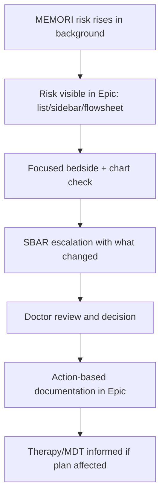
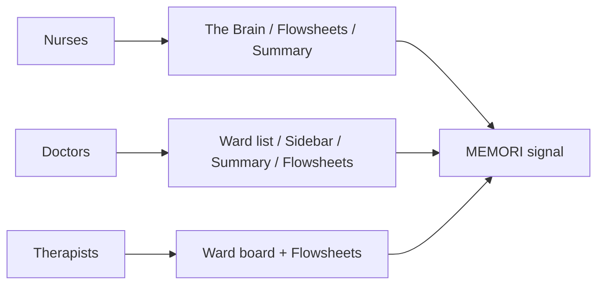
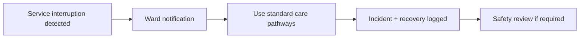

# Royal Devon University Healthcare NHS Foundation Trust (RDUH)
## Yealm & Clyst Stroke Services

# MEMORI Clinical Deployment Protocol (Draft)

**Date:** 11 February 2026  
**Document ID:** Co-Design 01 Clinical Deployment Protocol  
**Version:** 1.0  
**Status:** Draft for internal review and RDUH stakeholder sign-off  
**Applies to:** RDUH only (Yealm & Clyst initial deployment; future wards via formal change control)  
**Device:** MEMORI (EU MDR Class IIb SaMD)  
**Owner:** Clinical Deployment Lead  
**Approver:** RDUH & Sanome

---

## 1) Executive Summary

This protocol defines how MEMORI will be deployed **safely, clearly, and with minimal workflow disruption** in RDUH stroke services (Yealm and Clyst) during Phase 1.

MEMORI is an AI-enabled, advisory clinical decision support tool for **early recognition of hospital-acquired infection (HAI) risk**. It is non-interruptive and does not diagnose infection or prescribe treatment.

### Phase 1 objectives
- Improve early recognition of HAI risk.
- Reduce manual data hunting across Epic.
- Improve SBAR quality by surfacing “what changed.”
- Avoid additional alert fatigue.
- Integrate within existing Epic workflows.

### What this protocol covers
- Clinical setting, population, and intended use boundaries.
- Governance, safety controls, and responsibilities.
- Epic placement model and escalation ladder.
- Go-live readiness, hypercare, downtime, and monitoring.
- PMCF-aligned post-market evaluation.
- Formal change control process.

---

## 2) Clinical Setting, Population, and Scope

### 2.1 Clinical setting
- **Clyst Ward:** Hyperacute/acute stroke and healthcare for older people.
- **Yealm Ward:** Stroke rehabilitation with mixed medical patients.

### 2.2 Population
Adult inpatients under stroke and neuro-rehabilitation care, including patients with:
- Prolonged length of stay.
- Frailty and multimorbidity.
- High aspiration, UTI, and chest infection risk.
- Subtle/atypical deterioration patterns.

### 2.3 Phase 1 scope boundaries
Phase 1 is limited to:
- Yealm and Clyst only.
- Early HAI risk recognition only.
- Non-interruptive Epic integration (patient list, sidebar, flowsheets).
- Advisory guidance only (no automated prescribing/decision-making).

Any expansion requires formal change control.

---

## 3) Intended Use and Non-Use Boundaries

### 3.1 Intended clinical objective
Improve earlier recognition and review of HAI risk by surfacing a non-intrusive risk signal and concise “what changed” context, enabling timely assessment and escalation.

### 3.2 MEMORI will
- Display risk levels: **Low / Moderate / High / Critical**.
- Provide brief explainability and trend context.
- Support prioritisation and escalation when clinically indicated.

### 3.3 MEMORI will not
- Replace clinical judgment, NEWS2, or local policy.
- Diagnose sepsis, stroke recurrence, PE, or other non-infective deterioration in this phase.
- Force actions via uncontrolled pop-ups.

---

## 4) Why MEMORI Is Needed at RDUH

Key workflow and safety pressures identified in co-design:
- High cognitive load from fragmented data across Epic views.
- No single “what changed” shift-to-shift view.
- MDT inputs and trends can be difficult to find quickly.
- Existing alert burden is already high.
- Stroke/neuro-rehab deterioration can be subtle, qualitative, and atypical.

---

## 5) Governance and Oversight

Phase 1 is jointly overseen by RDUH and Sanome roles:
- RDUH Clinical Sponsor (Stroke Services)
- RDUH Digital/Epic Team
- RDUH Clinical Safety Officer (DCB0160)
- RDUH Information Governance
- Sanome Engineering Lead
- Sanome Clinical Deployment Lead
- Sanome Clinical Safety Officer (DCB0129)

### Oversight responsibilities
- Approve Epic placement and role visibility.
- Approve risk interpretation and NBA wording.
- Review hazard log and controls.
- Sign off go-live readiness.
- Monitor hypercare safety.
- Approve post-go-live changes via change control.

> No live deployment occurs without formal RDUH clinical, digital, and safety approval.

---

## 6) Co-Design Method and Workflow Mapping

### 6.1 Method
Co-design sessions captured current workflows and designed target workflows across nurses, doctors, and therapies.

### 6.2 Capture fields per workflow step
- Step and Epic location.
- Inputs and decision point.
- Output action (note/order/escalation).
- Pain points/workarounds.
- Safety risks and MEMORI opportunity.

### 6.3 Co-design findings translated to protocol requirements
| Co-design finding | Protocol requirement |
|---|---|
| “Too many clicks” | Minimal surfaces + deep links + short role-based training |
| “Do not want more alerts” | Non-interruptive placements only |
| “Need what changed” | Delta/trend explainability required |
| Rotating staff | Mandatory training and adoption tracking |
| Complex ward mix | Explicit downtime and safety controls |

---

## 7) Target-State Workflow (With MEMORI)

### Design principle
**Notice first, explore when needed.** MEMORI provides passive situational awareness; clinical action remains judgement-led.

---

## 8) Epic Integration Model

### 8.1 Preferred surfaces
1. **Patient list** (risk column for triage/prioritisation).
2. **Patient sidebar tile** (persistent contextual visibility).
3. **Nursing flowsheet indicator** (alongside observations and trends).

### 8.2 Placement principles
- Embed where teams already work.
- Avoid pop-up alert burden.
- Keep click paths short.
- Maintain role relevance across nurses, doctors, and therapists.

---

## 9) Risk Levels and Next Best Actions (NBA)

### 9.1 Risk level model
| Risk level | Colour | Meaning |
|---|---|---|
| Low | 🟢 Green | Baseline |
| Moderate | 🟡 Amber | Watch closely |
| High | 🟠 Orange | Urgent review |
| Critical | 🔴 Red | Immediate escalation |

Risk levels support awareness and prioritisation; they do not diagnose infection or mandate treatment.

### 9.2 NBA principles
- Short, role-appropriate, policy-aligned prompts.
- Advisory only.
- No mandatory automated actions without local approval and safety sign-off.

---

## 10) Human Factors, Training, and Adoption

### 10.1 Human factors principles
- Visible but non-intrusive by default.
- Explainability in concise plain language.
- Clear “what changed” direction and drivers.
- Fit intermittent chart-checking patterns.

### 10.2 Training audience
- Nurses (including nurse-in-charge)
- Junior doctors, registrars, consultants
- Locum and out-of-hours cover teams
- Therapies (OT/Physio/SALT)
- Digital champions/superusers

### 10.3 Training outcomes
Users should be able to:
- Explain what MEMORI is/is not.
- Locate MEMORI in configured Epic views.
- Interpret risk safely and consistently.
- Use “what changed” context in SBAR.
- Document action-based responses without duplication.
- Follow downtime procedure.

### 10.4 Training methods
- 10–15 minute role-specific microlearning.
- Ward huddles and handover reinforcement.
- Superuser support in hypercare.
- One-page quick reference guides.
- Scenario-based drills (e.g., aspiration, UTI/confusion, subtle rehab deterioration).

---

## 11) Go-Live, Hypercare, and Downtime

### 11.1 Readiness checklist (headline)
- Governance approvals complete.
- Epic configuration tested in agreed environment.
- Role visibility confirmed.
- NBA text signed off.
- Training threshold achieved.
- Downtime plan published.
- Support rota and issue-triage pathway active.
- Monitoring dashboards ready.
- Controlled rollout sequence agreed.

### 11.2 Hypercare monitoring
- Daily checks: visibility, location concordance, safety concerns, technical health.
- Weekly summary to steering/governance group during early phase.

### 11.3 Downtime procedure
If Epic, MEMORI, or key data feeds are unavailable:
1. Notify ward teams via agreed channel.
2. Suspend reliance on MEMORI signals.
3. Continue standard clinical pathways.
4. Log incident and recovery time.
5. Perform post-incident safety review when indicated.

---

## 12) Clinical Safety and PMCF Evaluation

### 12.1 Safety case alignment
- Deployment-specific hazard log maintained.
- Controls mapped to hazards and residual risk sign-off recorded.
- Incident response pathway defined.

### 12.2 Key hazard focus: ward/location correctness
Known risk: incorrect or delayed location mapping can show signals for wrong cohort.

Required controls:
- Validate bed/ward location feeds against authoritative RDUH source.
- Daily sample concordance checks in early go-live.
- Trigger thresholds for missing/mismatched location.
- Defined incident pathway for mismatch events.

### 12.3 PMCF-aligned evaluation goals
- Confirm workflow fit and usability.
- Confirm operational safety and absence of unsafe reliance.
- Identify early value signals in recognition/escalation quality.

### 12.4 Monitoring domains and reporting cadence
**Domains:** Adoption, Clinical, Technical, Safety (PMS/PMCF).  
**Reporting points:** Month 1, Month 3, Month 6, Month 12 + continuous monitoring.

---

## 13) Change Control

### 13.1 Changes requiring formal control
- Any Epic placement changes.
- Any software/config updates affecting behaviour.
- Any risk threshold/wording interpretation changes.
- Any NBA changes.
- Expansion to new wards or intended uses.
- Data feed changes affecting reliability.

### 13.2 Change governance steps
1. Change logged.
2. Safety impact assessed.
3. Clinical sponsor approval.
4. Digital approval for Epic changes.
5. Sanome regulatory approval.
6. Communication and training updates as needed.

---

## 14) Deliverables

- Final deployment protocol.
- Co-design evidence pack and workflow maps.
- Epic placement decision log and escalation ladder.
- Training pack, go-live plan, hypercare plan, downtime plan.
- Safety artefacts (hazard log, controls, monitoring checks).
- PMCF evaluation plan.
- Risk log and change control record.

---

## Appendix A — Stakeholders (summary)

Stakeholder groups engaged:
- Clinical leadership and sponsors.
- Ward nursing teams and ward management.
- Stroke/neuro-rehab medical staff (consultants, registrars, juniors).
- Therapy teams (OT/Physio/SALT).
- Digital/Epic and clinical safety functions.
- Sanome deployment, product, engineering, and safety leads.

## Appendix B — Epic Surfaces and Device Reality (summary)

| Epic surface | Primary users | Typical use | MEMORI implication |
|---|---|---|---|
| Flowsheets | Nurses (+ doctors/therapies) | Observations and trends | Primary indicator location |
| Patient list | Doctors, nurse-in-charge | Triage and ward-round prep | Risk column |
| Sidebar | Mixed roles | Persistent patient review context | Non-intrusive tile |
| Summary | Doctors/nurses | At-a-glance review | Optional signal where uncluttered |
| Results/Imaging | Doctors | Diagnostic drill-down | Link-outs only, no interruption |
| Notes | Doctors | Narrative and plans | Action-based documentation only |

## Appendix C — Source Material
- Co-design and workflow mapping transcripts (05 February 2026).
- Attendee and stakeholder lists.
