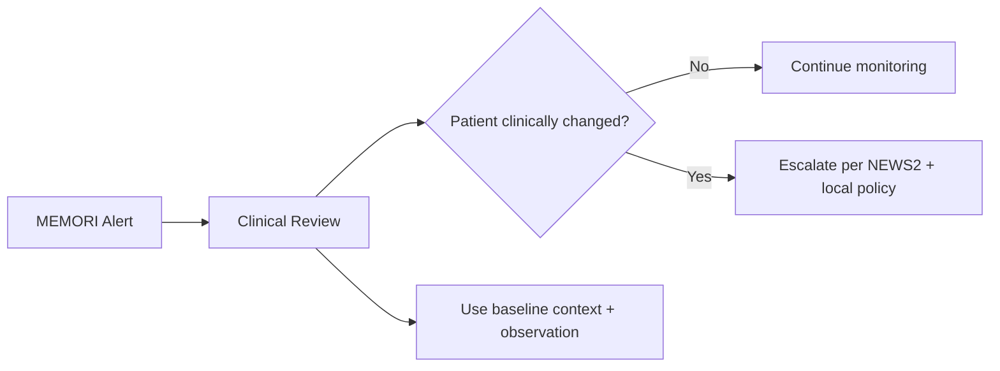
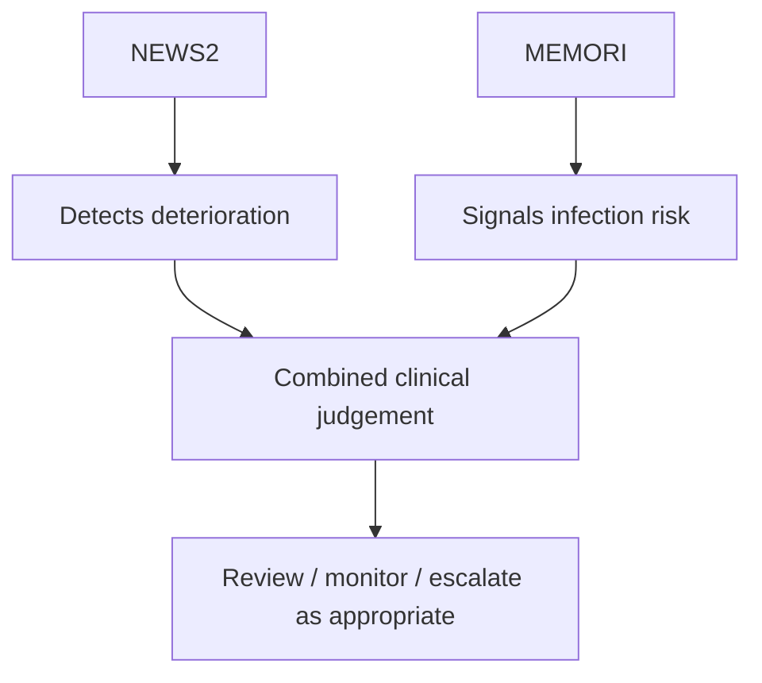
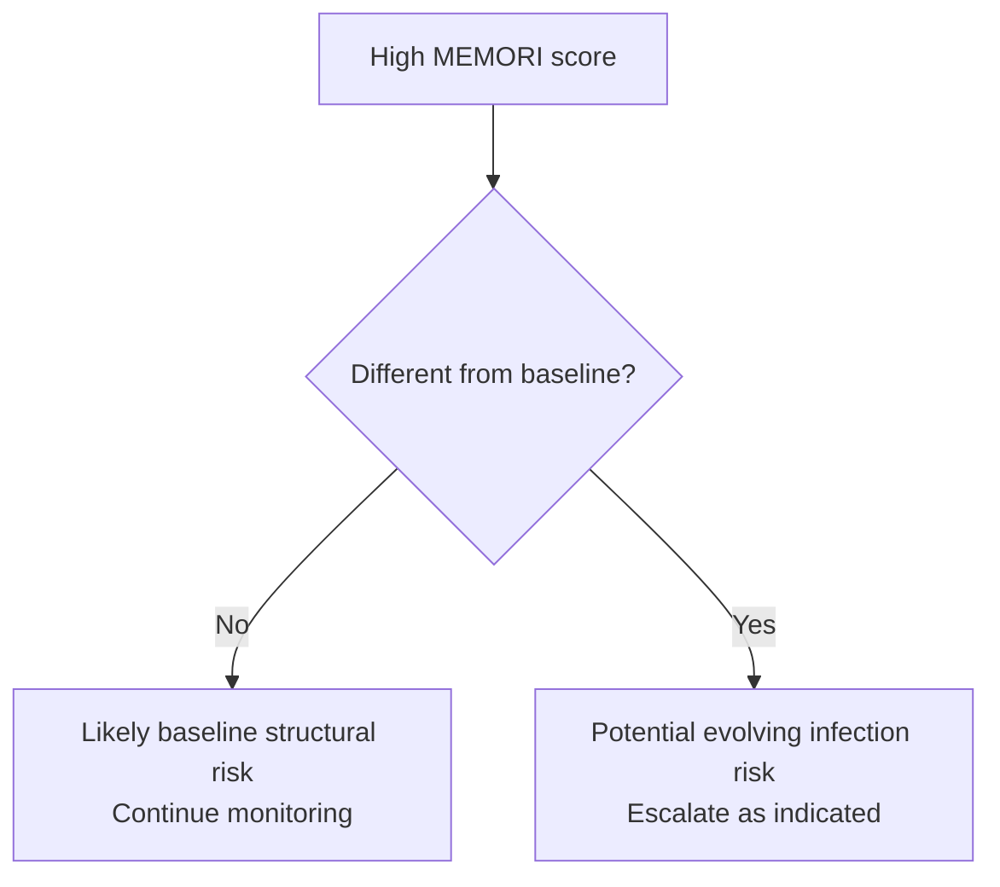
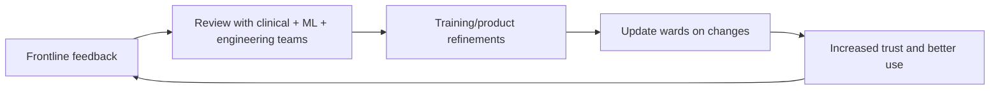

# RHN Early Adoption Feedback and Key Insights

## Month 1 PMS/PMCF Summary

Early findings from Drapers Ward show strong adoption momentum for MEMORI. The tool is visible in workflow, clinically interpretable, and generally being used as intended: to support review and monitoring decisions rather than trigger automatic escalation.

---

## 1) Executive Highlights

- **Workflow fit is strong:** Staff can easily find MEMORI risk levels in PatientSource and report natural day-to-day integration.
- **Use aligns with intent:** Alerts are treated as prompts for clinical review, with escalation used selectively when clinically indicated.
- **Core adoption challenge has shifted:** Access is no longer the primary barrier; consistent interpretation and confidence-building now matter most.
- **RHN feedback is high-value:** Teams are actively contributing nuanced insight (baseline risk, high-complexity cohorts, contextual interpretation), creating a strong platform for iterative improvement.

---

## 2) Adoption Model: What MEMORI Is (and Is Not)

### MEMORI is:
- an **infection-risk early warning** signal
- a **clinical decision support (CDS)** input

### MEMORI is not:
- a replacement for **NEWS2**
- a diagnosis tool
- an instruction to escalate

> **Core message:** MEMORI supports clinical judgement; it does not replace it.

---

## 3) MEMORI and NEWS2: Complementary, Not Competing

A critical training point is explicit differentiation:

- **NEWS2:** detects physiological deterioration
- **MEMORI:** highlights infection risk

Both are needed. One does not invalidate the other.

---

## 4) Interpreting Risk in High-Complexity RHN Patients

In neuro-disability and long-stay cohorts, many patients have persistent structural risk factors (for example: ventilators, catheters, feeding tubes, chronic complexity). This can legitimately keep scores in moderate/high ranges.

### Practical implication
A high score does **not** automatically mean escalation. It means: **review in context**, especially against baseline.

### Clinical anchor question
- *Is this patient different from their usual state?*

---

## 5) Key Month 1 Learning Themes

1. **No early signal of alert disregard:** Non-escalation generally reflected clinical stability.
2. **Explainability is a strength:** Understanding is good, but trust still requires repeated exposure and practical examples.
3. **“Clinical copilot” framing resonates:** MEMORI supports situational awareness and prioritisation without replacing decision-making.
4. **Alert fatigue remains a watchpoint:** No clear early concern, but burden and exposure should be tracked longitudinally.

---

## 6) What to Reinforce in Training (RHN and Future Sites)

### Mandatory content set

A. What MEMORI is/is not (CDS signal; not diagnosis/instruction/NEWS2 replacement)

B. MEMORI vs NEWS2 (standard slide in every deck)

C. Safe interpretation framework:
- clinical context
- baseline condition
- other indicators
- change from usual state

D. Valid responses to alerts:
- review
- monitoring
- escalation where clinically indicated

E. High-baseline-risk examples:
- ventilated patients
- catheterised patients
- long-stay complex patients

F. Explicit guardrails:
- high scores do not automatically mean escalation
- low scores do not rule out concern

G. Stewardship message:
- MEMORI should not drive unnecessary antimicrobial escalation

H. Feedback and safety routes:
- local reporting pathways
- Yellow Card awareness
- direct feedback channels to the MEMORI team

I. Clinician contribution:
- feedback is actively used to refine the system

---

## 7) Engagement Strategy: From Feedback to Improvement

Adoption accelerates when teams see visible progression:

**feedback → action → improvement**

### Practical mechanisms
- ward feedback forms
- champion-led collection
- brief handover discussions
- post–go-live logs
- regular “you said, we did” updates

---

## 8) Messages for Ward Managers and Matrons

### What we are seeing
- MEMORI is integrating well into workflow.
- Clinicians are reviewing the dashboard.
- Alerts are generally perceived as clinically realistic.
- Responses are thoughtful rather than automatic.
- RHN teams are generating high-quality improvement feedback.

### What we are reinforcing
- MEMORI supports, not replaces, clinical judgement.
- MEMORI does not replace NEWS2.
- High scores require interpretation in context.
- Monitoring without escalation is often appropriate.
- Baseline context is especially important in complex cohorts.

### What we are doing next
- Review RHN feedback with engineering and ML teams.
- Strengthen training and engagement materials.
- Monitor alert patterns and clinical responses over time.
- Use RHN learning to improve future deployments.

---

## 9) Strategic Opportunity: RHN as a Clinical–AI Learning Site

RHN’s depth of feedback (including interest in explainability approaches and patient-specific patterns) supports positioning RHN as a co-development environment for safe AI use in complex care, not only a deployment destination.

This supports:
- stronger ownership
- better-quality clinical feedback
- higher-confidence adoption
- improved transfer of learning to future sites

---

## 10) Most Important Overall Adoption Insight

**Clinicians are asking the right questions early** (meaning, baseline effects, escalation thresholds, and interaction with NEWS2). That is a strong signal of safe adoption.

Thoughtful challenge is not resistance; it is a marker of responsible clinical engagement with AI-enabled decision support.
