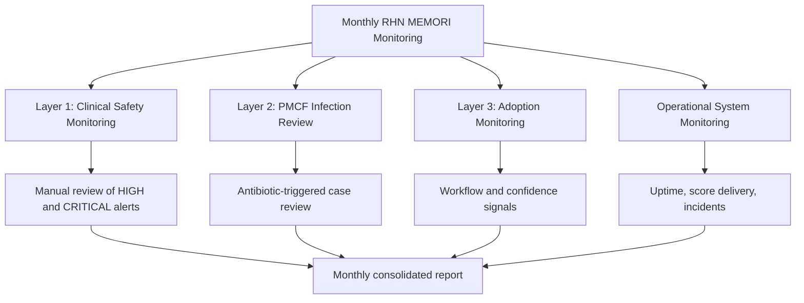
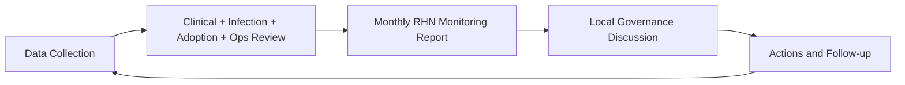

# RHN PMS / PMCF Monitoring Plan (Monthly)

## Document Purpose

This document defines the monthly monitoring and reporting approach for MEMORI deployment at RHN sites:

- Drapers
- JEC
- Leonora

The report summarises:

1. Clinical safety monitoring
2. Infection review findings (via the Infection Review Framework)
3. Adoption signals
4. Operational system monitoring

This reporting structure supports:

- MDR Post-Market Surveillance (PMS)
- Post-Market Clinical Follow-Up (PMCF)
- Local clinical governance

---

## Monthly Monitoring Structure

Monthly monitoring has three primary review layers and one cross-cutting operational layer.

### Layer 1 — Clinical Safety Monitoring

Manual review of **HIGH** and **CRITICAL** MEMORI alerts to assess:

- Clinical plausibility
- Clinical response
- Potential safety concerns

### Layer 2 — PMCF Infection Review

Infection cases are reviewed using the **MEMORI Infection Review Framework (Antibiotic-Triggered)**. The framework defines case identification, classification, and review process. Monthly reporting includes summary outputs from those reviews.

### Layer 3 — Adoption Monitoring

Monitoring whether MEMORI is:

- Visible to staff
- Reviewed during care decisions
- Interpreted appropriately
- Integrated into workflow

Focus is on identifying and removing adoption blockers quickly.

---

## 1) Clinical Safety Monitoring (PMS)

These measures support post-market surveillance of clinical safety.

| Sentinel ID | Outcome | Measurement | Collection Method |
|---|---|---|---|
| ID001 | Reduced time to clinical decision or intervention | Time between MEMORI alert and intervention (antibiotics / investigations / monitoring) | Wasabi data + clinical review |
| ID003 | MEMORI triggers an intervention | Alerts leading to clinical response | PatientSource note review |
| ID005 | MEMORI does not lead to unnecessary treatment | Alerts followed by antibiotic initiation | Medication chart review |
| ID008 | MEMORI does not over-alert | Alerts not followed by treatment (proxy FP) | Alert review + prescription check |
| ID009 | MEMORI does not under-alert | Infection events without prior alert (proxy FN) | Infection review comparison |

### What is monitored monthly

- Number of HIGH alerts by ward
- Number of CRITICAL alerts by ward
- Alerts checked for clinical plausibility
- Alerts that triggered clinical intervention
- Alerts followed by antibiotic treatment
- Potential false positives / false negatives (proxy)
- Any clinically implausible scores or safety concerns

### How this is collected

For each HIGH or CRITICAL alert, review the clinical notes to determine whether there was:

- Medical review
- Increased observations
- Blood tests ordered
- Imaging requested
- Antibiotics started or escalated
- Monitoring only
- No action documented

**Purpose:** understand how alerts are interpreted and acted on; not to prove benefit.

---

## 2) PMCF Infection Review

PMCF infection review activity uses the MEMORI Infection Review Framework.

The framework defines:

- Antibiotic-triggered case identification
- MEMORI risk trajectory review
- Clinical context analysis
- Classification: true positive / false positive / false negative / prophylaxis / uncertain

### Sentinel PMCF Indicator

| Sentinel ID | Outcome | Measurement | Collection Method |
|---|---|---|---|
| ID064 | Antibiotic intention | Distinguish therapeutic vs prophylactic prescribing | Medication record review |

### Monthly monitoring output

From the infection review process report, include:

- Total antibiotic events reviewed
- True positives
- False positives
- False negatives
- Prophylaxis events (excluded from performance denominator)
- Uncertain cases

Also report key clinical learning points:

- Detection patterns
- Missed infections
- Prescribing behaviour
- Interpretation of alerts

> The detailed case-review process is defined in the Infection Review Framework and is not repeated here.

---

## 3) Adoption Monitoring

Adoption monitoring ensures MEMORI is used as intended within clinical workflow.

| Sentinel ID | Outcome | Measurement | Collection Method |
|---|---|---|---|
| ID018 | MEMORI used daily | Dashboard use / mentions in clinical discussion | Analytics + ward observation |
| ID019 | MEMORI improves workflows | Workflow feedback | Ward discussions |
| ID020 | Explainability dashboard usefulness | Dashboard engagement | Analytics + feedback |
| ID021 | Clinical confidence in MEMORI | Staff confidence levels | Survey / huddles |
| ID023 | Agreement with MEMORI predictions | Clinician agreement with score | Pulse survey |

### What is monitored monthly

- Staff feedback themes
- Workflow observations
- Examples where MEMORI supported decision-making
- Adoption barriers
- Superuser engagement

### How this is collected

- Ward discussions
- Safety huddles
- Brief pulse checks
- Superuser observations
- Occasional short surveys (if needed)

---

## Monthly Feedback Form

The Monthly Feedback Form captures qualitative insights that cannot be extracted from system data.

| Sentinel ID | Category | Purpose |
|---|---|---|
| ID022 | Adoption | Confirm MEMORI used within intended use |
| ID067 | Clinical Safety | Identify alert fatigue risk |
| ID068 | PMCF | Capture context for non-actioned alerts |
| ID069 | PMCF | Record rationale for non-intervention |

### Feedback captured

- Intended use: are staff using MEMORI to support infection risk review?
- Alert interpretation: did alerts make clinical sense?
- Non-actioned alerts: why was no action taken?
- Workflow impact: did MEMORI support or slow decision-making?
- Adoption signals: MEMORI referenced during ward rounds and superuser support activity

---

## 4) Operational System Monitoring

These indicators are collected automatically through system monitoring.

| Sentinel ID | Outcome | Measurement | Collection Method |
|---|---|---|---|
| ID074 | MEMORI service availability | System uptime / outages | Infrastructure monitoring |
| ID075 | Score delivery reliability | Failed or delayed score updates | System logs |

### Monthly operational summary

- Uptime performance
- Score delivery failures or delays
- Alert volume trends

**Data sources:**

- Engineering monitoring dashboards
- Wasabi analytics logs
- Incident logs (where applicable)

---

## Data Required from Engineering (Wasabi)

### Data extraction windows

| Site | Start Date | End Date |
|---|---|---|
| Drapers | 18 Dec 2025 | Present |
| JEC | 10 Feb 2026 | Present |
| Leonora | 18 Feb 2026 | Present |

### MEMORI alerts (by ward)

Provide:

- Total MEMORI scores
- Number of HIGH alerts
- Number of CRITICAL alerts
- Alert timestamps
- Alerts per patient (if available)

### Alert → Antibiotic Timing (ID001)

Required fields:

- MEMORI alert timestamp
- Antibiotic prescription timestamp
- Time difference between alert and antibiotic initiation

### False Positive Proxy (ID008)

Alerts not followed by antibiotic prescription within the defined window.

### False Negative Proxy (ID009)

Cases where:

- Antibiotics were prescribed
- No preceding MEMORI alert occurred within the prior window

### Adoption signals (if available)

- MEMORI dashboard accesses
- MEMORI mentions in clinical notes

**Output format:** summary table plus raw export where available.

---

## Infection Review Framework (Referenced)

All infection case review and classification must follow the separate document:

**MEMORI Infection Review Framework (Antibiotic-Triggered)**

This framework defines:

- Case identification
- Data sources
- Review process
- Classification rules
- Monthly infection performance outputs

It forms the PMCF evidence generation method for RHN monitoring.

---

## Expected Monthly Report Output

Each RHN monthly monitoring report should include:

1. Clinical safety summary
2. Infection review summary
3. Adoption observations
4. Operational monitoring
5. Key learning points

Reports should remain short, structured, and focused on safety and learning.

---

## Suggested Report Template (One-Page Summary)

| Section | Required Content | Primary Owner |
|---|---|---|
| Clinical Safety | Alert volumes, interventions, proxy FP/FN, safety concerns | Clinical Safety Lead |
| PMCF Infection Review | TP/FP/FN/prophylaxis/uncertain + learning points | Infection Review Team |
| Adoption | Staff feedback, barriers, superuser activity, workflow impact | Site Implementation Lead |
| Operations | Uptime, delays/failures, trends/incidents | Engineering / Operations |
| Actions | Agreed corrective actions, owner, due date | Governance Group |

